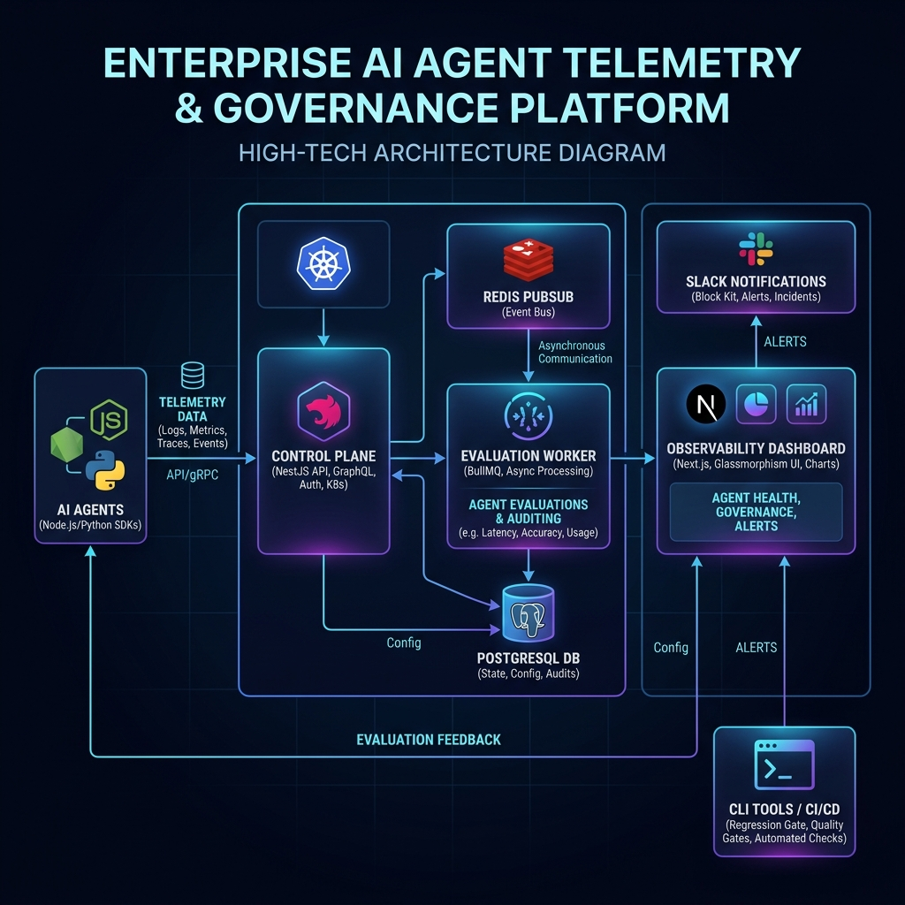
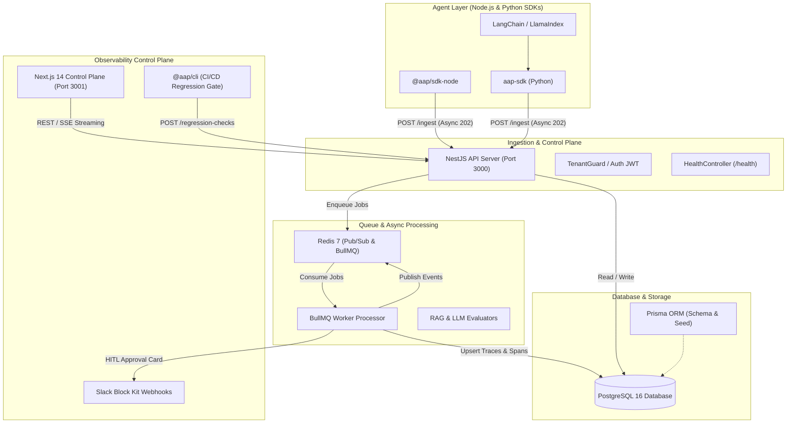
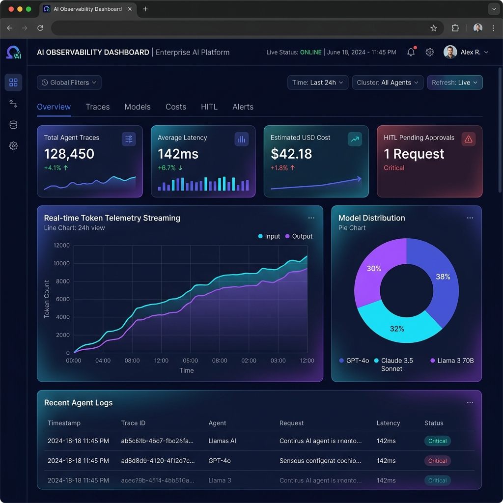
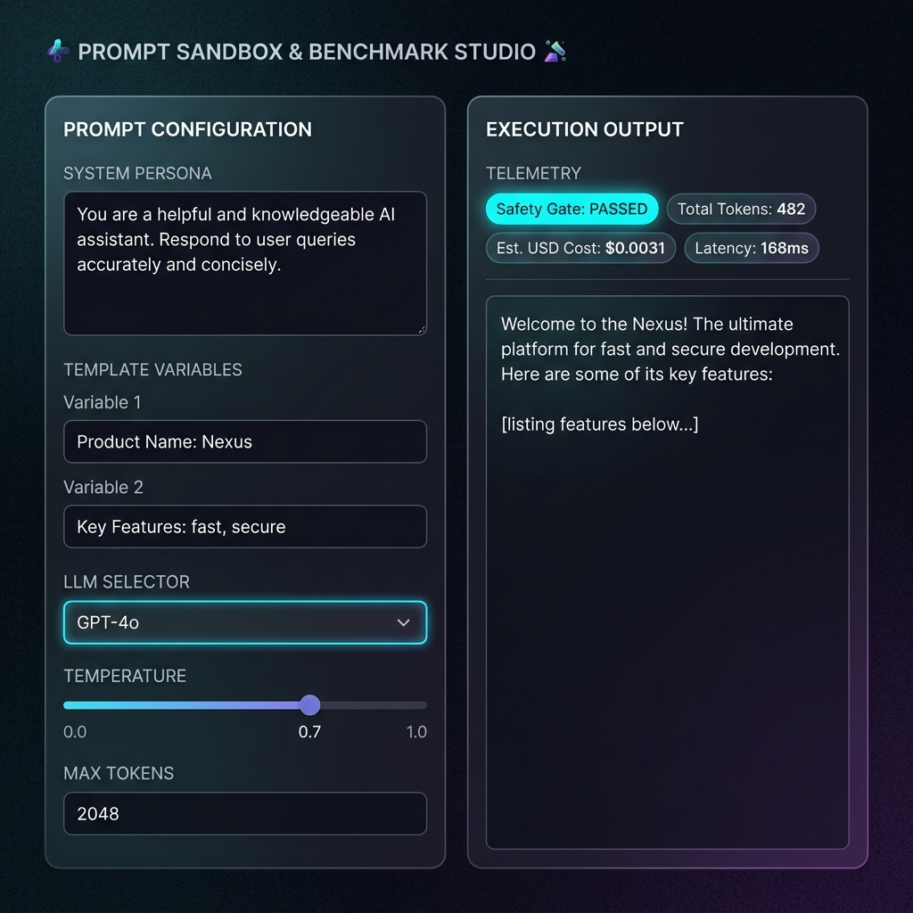
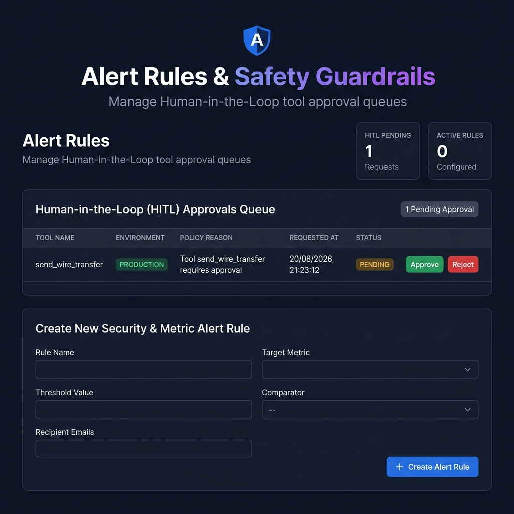
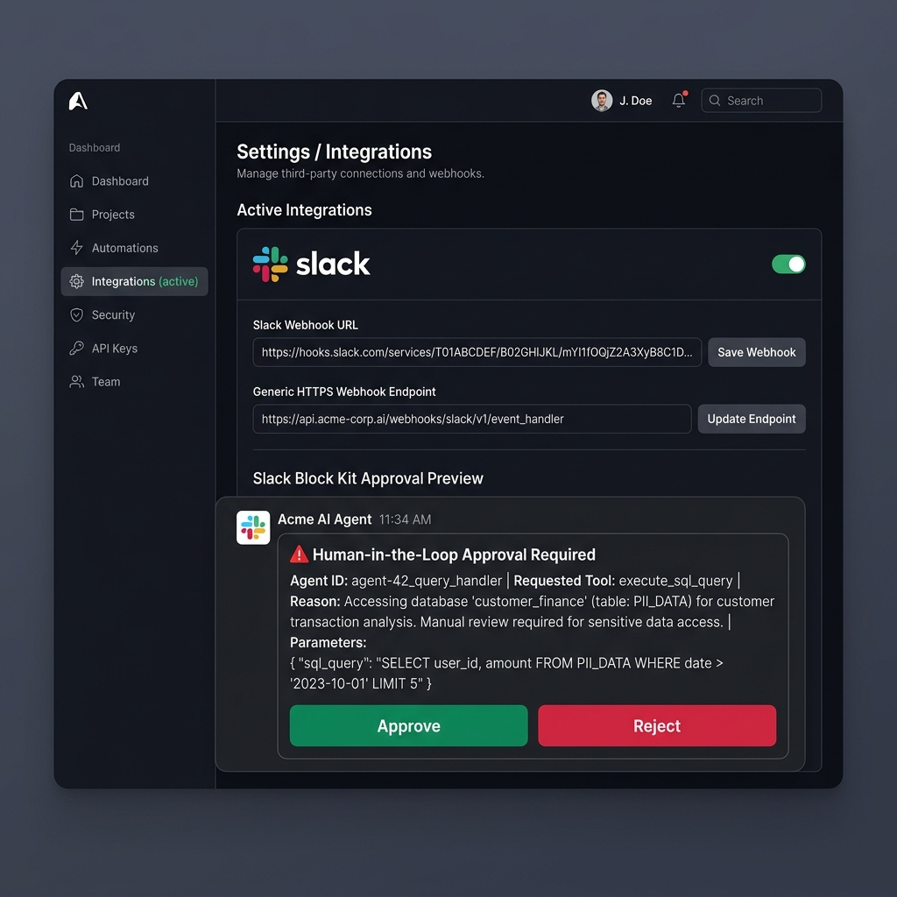
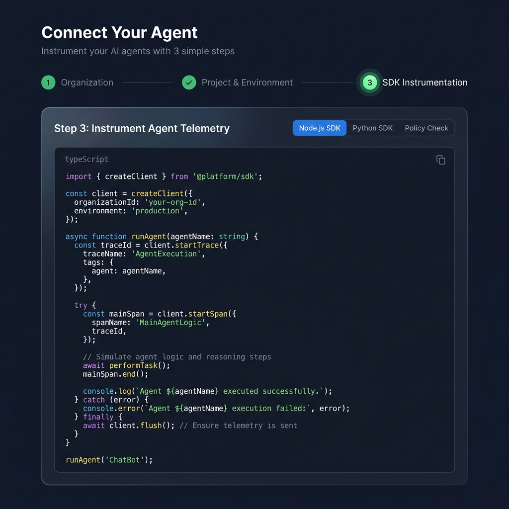

# 🚀 Enterprise AI Agent Reliability, Telemetry & Governance Platform

A production-grade, multi-tenant enterprise control plane and observability platform for monitoring, evaluating, and governing AI Agents in real-time. Built with a NestJS backend API, Redis Pub/Sub SSE telemetry stream, BullMQ async evaluation worker, Next.js 14 control plane dashboard, Node.js SDK (`@aap/sdk-node`), Python SDK (`aap-sdk`), and CI/CD Prompt Regression CLI (`@aap/cli`).

---

## 📐 1. Visual Platform Architecture





```text
ai-agent-platform-complete/
├── apps/
│   ├── api/             # NestJS Control Plane API Server (Port 3000)
│   ├── worker/          # BullMQ Async Dataset & RAG Evaluation Processor
│   ├── dashboard/       # Next.js 14 Glassmorphism Dashboard UI (Port 3001)
│   └── demo-agent/      # Integration Demo Agent (Port 4000)
├── packages/
│   ├── sdk-node/        # @aap/sdk-node - Node.js Agent Telemetry SDK
│   ├── sdk-python/      # aap-sdk - Python Agent Telemetry SDK
│   └── cli/             # @aap/cli - CI/CD Prompt Regression Testing Gate
├── prisma/              # Shared PostgreSQL Prisma Schema & Migrations
├── docker-compose.yml   # Enterprise Docker Stack (Postgres, Redis, API, Worker, Dashboard)
└── .env.production.example # Enterprise Production Environment Configuration
```

---

## 🖥️ 2. Dashboard UI Interface Walkthrough

### 📊 AI Observability & Trace Analytics


<details open>
<summary><b>🔍 View Full Interface Gallery (Prompt Sandbox, Governance, Slack & SDK Onboarding)</b></summary>
<br/>

#### 🧪 Prompt Sandbox & Benchmark Studio


#### 🛡️ Human-in-the-Loop Governance & Alerts Queue


#### 💬 Slack Block Kit & Webhooks Integrations


#### ⚡ Code Integration Onboarding (Node & Python SDKs)


</details>

---

## 🔥 3. Key Enterprise Features

### 1. Real-Time Telemetry & Natural Language Trace Search
- **Live SSE Streaming**: Real-time trace updates delivered directly to the dashboard via Server-Sent Events over Redis Pub/Sub.
- **Semantic Trace Engine**: Query traces using natural language keyword matching and vector filtering (`GET /projects/:projectId/traces/search/query?q=<term>`).

### 2. Multi-Language SDKs (Node.js & Python)
- **Node.js SDK (`@aap/sdk-node`)**: Non-blocking asynchronous batching with exponential retry backoff.
- **Python SDK (`aap-sdk`)**: PyPI package featuring `AapClient`, `@trace_span` function decorator, and `AapLangChainCallbackHandler`.

### 3. Human-in-the-Loop (HITL) Safety Guardrails
- **Tool Interceptor Policy Gates**: Intercept high-risk agent operations (`send_wire_transfer`, `database_drop`) before execution.
- **Interactive Approval Queue**: Review and resolve tool execution requests in the dashboard (`/alerts`).

### 4. Alert Channels & Slack Block Kit Integration
- **Slack Block Kit Cards**: Interactive Slack notifications with 1-click review and approve buttons dispatched directly to Slack channels.
- **Generic HTTPS Webhooks**: Configurable event dispatch for `APPROVAL_REQUIRED`, `PII_ALERT`, and `REGRESSION_WARN`.

### 5. Interactive Prompt Sandbox & Benchmark Studio
- Interactively test prompt templates, tune hyperparameters (Engine, Temperature, Max Tokens), simulate PII redaction, and benchmark latency and cost metrics (`/prompts/playground`).

### 6. RAG & LLM Quality Evaluators
- Async dataset evaluation runner computing **Faithfulness (Groundedness)**, **Context Relevance**, **Answer Relevance**, **Recall@K**, and **Ranking Quality**.

### 7. CI/CD Prompt Regression Gate CLI (`@aap/cli`)
- Run automated prompt regression suites in GitHub Actions (`aap eval`), exiting with `code 0` on PASS or `code 1` on FAIL to block broken prompt deployments.

### 8. SOC2 Audit Log CSV Exporter
- Immutable audit event logging with instant CSV export (`GET /organizations/:orgId/audit-events/export?format=csv`).

---

## 🛠️ 4. Step-by-Step Setup Guide

### Method A: Quick Local Development Setup

#### Prerequisites
- Node.js 18+ & npm 9+
- Python 3.9+ (for Python SDK)
- Docker Desktop (for PostgreSQL & Redis)

#### Step 1: Clone & Install Dependencies
```bash
git clone https://github.com/your-org/ai-agent-platform.git
cd ai-agent-platform
npm install
```

#### Step 2: Start Local Infrastructure (PostgreSQL & Redis)
```bash
docker compose up -d postgres redis
```

#### Step 3: Run Database Migrations & Seed Data
```bash
npm run db:generate
npm run db:migrate -- --name init
npm run db:seed
```

#### Step 4: Start Applications
Open separate terminal windows and run:

```bash
# Terminal 1: NestJS API Server (Port 3000)
npm run start:api

# Terminal 2: BullMQ Async Worker
npm run start:worker

# Terminal 3: Next.js Dashboard UI (Port 3001)
npm run start:dashboard

# Terminal 4: Integration Demo Agent (Port 4000)
npm run start:integration
```

Visit the dashboard at **[http://localhost:3001](http://localhost:3001)**.

---

### Method B: Production Docker Compose Deployment

Deploy the entire enterprise platform in containerized production mode with a single command:

```bash
# 1. Copy production env template
cp .env.production.example .env

# 2. Build and launch all services
docker compose up -d --build
```

#### Services Container Health Matrix:
- 🌐 **Dashboard UI**: `http://localhost:3001`
- ⚙️ **API Control Plane**: `http://localhost:3000`
- 🛡️ **Health Probe Endpoint**: `http://localhost:3000/health`
- 🤖 **Demo Agent**: `http://localhost:4000`
- 🐘 **PostgreSQL**: `localhost:5432`
- ⚡ **Redis Cache**: `localhost:6379`

---

## 📦 5. SDK Quick Start & Instrumentation

### 1. Node.js SDK (`@aap/sdk-node`)

```bash
npm install @aap/sdk-node
```

```typescript
import { createClient } from '@aap/sdk-node';

const aap = createClient({
  apiKey: process.env.AAP_API_KEY!,
  baseUrl: 'http://localhost:3000',
});

async function runAgent(userQuery: string) {
  const trace = aap.startTrace({ agentId: 'support-agent' });
  const span = trace.startSpan({ eventType: 'llm', provider: 'openai', model: 'gpt-4o' });

  try {
    const result = await callLLM(userQuery);
    span.end({
      status: 'ok',
      inputTokens: result.usage.input_tokens,
      outputTokens: result.usage.output_tokens,
      cost: result.cost,
    });
    return result.text;
  } catch (err: any) {
    span.end({ status: 'error', errorMessage: err.message });
    throw err;
  }
}

await aap.flush();
```

---

### 2. Python SDK (`aap-sdk`)

```bash
pip install aap-sdk
```

```python
from aap_sdk import AapClient, check_tool_policy, trace_span
import os

aap = AapClient(
    api_key=os.getenv("AAP_API_KEY"),
    base_url="http://localhost:3000"
)

# Check HITL Governance Policy
policy = aap.check_tool_policy("send_wire_transfer", environment="production")
if policy.is_blocked:
    print(f"Execution Blocked: {policy.reason}")

# Instrument Agent Function with Automatic Telemetry Tracing
@trace_span(client=aap, agent_id="finance-agent", provider="openai", model="gpt-4o")
def process_financial_transfer(account_id: str, amount: float):
    return "Transfer processed successfully"

process_financial_transfer("ACC-9021", 5000.00)
```

---

## 🤖 6. CI/CD Prompt Regression Gate CLI (`@aap/cli`)

Run automated prompt quality gates in your GitHub Actions deployment pipelines:

```bash
npm install -g @aap/cli

# Run regression evaluation check
aap eval --api-key=$AAP_API_KEY --project-id=$PROJECT_ID --dataset-id=$DATASET_ID
```
- **Exit Code 0**: All prompt evaluation criteria PASSED.
- **Exit Code 1**: Regression detected, blocking pipeline deployment.

---

## 📋 7. Comprehensive API Route Reference

```text
AUTH & ORGANIZATIONS:
POST   /auth/register                           -> Register developer user & return JWT
POST   /auth/login                              -> Login developer user & return JWT
POST   /organizations                           -> Create organization
GET    /organizations                           -> List organizations
GET    /organizations/:orgId/audit-events/export -> Export SOC2 audit log CSV

PROJECTS & INTEGRATIONS:
POST   /organizations/:orgId/projects           -> Create project
GET    /projects/:projectId                     -> Get project details
PATCH  /projects/:projectId/integrations        -> Update Slack & Webhook alert channels

API KEYS & INGESTION:
POST   /projects/:projectId/api-keys            -> Issue API Key
POST   /ingest                                  -> Ingest telemetry spans (202 Accepted)

TELEMETRY & SEARCH:
GET    /projects/:projectId/analytics/summary    -> Get dashboard telemetry metrics
GET    /projects/:projectId/traces              -> List traces
GET    /projects/:projectId/traces/stream       -> SSE real-time trace updates
GET    /projects/:projectId/traces/search/query -> Natural language semantic trace search

PROMPT SANDBOX & GOVERNANCE:
POST   /projects/:projectId/prompts/sandbox/execute -> Execute prompt sandbox benchmark
GET    /projects/:projectId/approvals           -> List pending HITL tool approvals
POST   /projects/:projectId/approvals/:id/resolve -> Approve or Reject tool execution
GET    /health                                  -> Liveness & Readiness health probe
```

---

## 📚 8. Master Platform Architectural Guides

For technical deep-dives into specific subsystems, consult the comprehensive architectural guides in the `docs/` directory:

| Architecture Guide | Focus & Subsystems | Document Link |
| :--- | :--- | :--- |
| 🏛️ **Architecture & Team Guide** | Core NestJS/Next.js stack, Redis Pub/Sub, BullMQ, Prisma schema & DB design | [ARCHITECTURE_AND_TEAM_GUIDE.md](docs/ARCHITECTURE_AND_TEAM_GUIDE.md) |
| 💰 **FinOps & Cost Optimization** | Model cascading, exact/semantic caching, context pruning, batch APIs, vLLM | [ENTERPRISE_AI_COST_OPTIMIZATION_FINOPS_GUIDE.md](docs/ENTERPRISE_AI_COST_OPTIMIZATION_FINOPS_GUIDE.md) |
| 🛡️ **Governance & HITL Safety** | Tool policy interceptors, Slack Block Kit 1-click approvals, PII regex redactor, SOC2 audit | [GOVERNANCE_AND_HITL_SAFETY_GUIDE.md](docs/GOVERNANCE_AND_HITL_SAFETY_GUIDE.md) |
| 🔍 **RAG Pipeline & Quality Evals** | Hybrid BM25+Vector search, Cross-Encoder reranking, Ragas triad evals, `@aap/cli` CI/CD gate | [RAG_EVALUATION_AND_RERANKING_GUIDE.md](docs/RAG_EVALUATION_AND_RERANKING_GUIDE.md) |
| ⚡ **Telemetry & Observability** | Non-blocking ingestion, SDK async batching, Redis SSE streaming, semantic trace search | [TELEMETRY_AND_OBSERVABILITY_GUIDE.md](docs/TELEMETRY_AND_OBSERVABILITY_GUIDE.md) |
| 🚀 **vLLM Serving & Quantization** | PagedAttention, prefix caching, PEFT/LoRA fine-tuning, AWQ 4-bit quantization, VRAM math | [MODEL_SERVING_AND_QUANTIZATION_GUIDE.md](docs/MODEL_SERVING_AND_QUANTIZATION_GUIDE.md) |
| 🤖 **Agentic AI Interview Q&A** | Top 25 Architect Q&As on ReAct loops, LangGraph vs Temporal, MCP protocols, Multi-agent swarms | [AGENTIC_AI_INTERVIEW_QUESTIONS_AND_ANSWERS.md](docs/AGENTIC_AI_INTERVIEW_QUESTIONS_AND_ANSWERS.md) |
| 🚀 **Zero-to-Hero AI Architect Roadmap** | Complete Phase 0 to Stage 6 roadmap with 8 flow diagrams, math formulas, & 40 Q&As | [ZERO_TO_HERO_AI_ARCHITECT_INTERVIEW_ROADMAP.md](docs/ZERO_TO_HERO_AI_ARCHITECT_INTERVIEW_ROADMAP.md) |

---

## 📜 9. License
MIT License. Developed for enterprise AI Agent reliability, governance, and observability.
