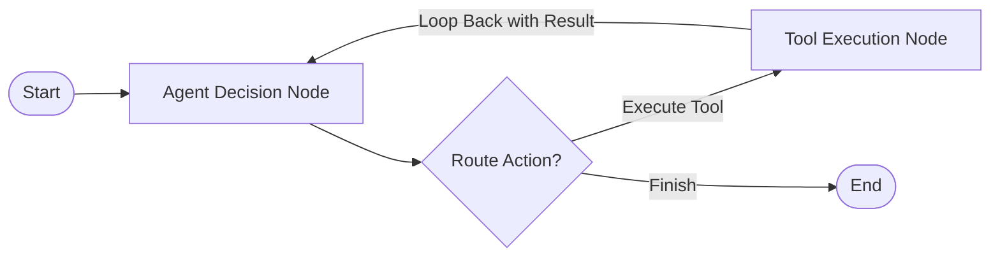

# 🤖 Enterprise Agentic AI: Top 25 Architect & Senior Engineer Interview Q&A
## Comprehensive Deep-Dive into Agentic Reasoning, LangGraph, Model Context Protocol (MCP), Multi-Agent Swarms & Production Guardrails

---

## 📋 Table of Contents
1. [Domain 1: Agentic Loops & Reasoning Patterns (Q1 – Q5)](#domain-1-agentic-loops--reasoning-patterns)
2. [Domain 2: Agent State Management & Graph Orchestration (Q6 – Q10)](#domain-2-agent-state-management--graph-orchestration)
3. [Domain 3: Tool Protocols & Model Context Protocol (MCP) (Q11 – Q15)](#domain-3-tool-protocols--model-context-protocol-mcp)
4. [Domain 4: Multi-Agent Systems & Supervisor Patterns (Q16 – Q20)](#domain-4-multi-agent-systems--supervisor-patterns)
5. [Domain 5: Production Safety, Guardrails & FinOps (Q21 – Q25)](#domain-5-production-safety-guardrails--finops)

---

## 🧠 Domain 1: Agentic Loops & Reasoning Patterns

### Q1: What is the fundamental difference between standard Chain-of-Thought (CoT) prompting and an Agentic ReAct loop?

**Answer:**
* **Chain-of-Thought (CoT)** is a *static, single-pass* prompting technique where the LLM breaks down complex reasoning into intermediate steps before returning a final answer. The LLM cannot interact with the external world or adjust its plan based on external runtime execution results.
* **ReAct (Reason + Act)** is a *dynamic, iterative loop* that interleaves reasoning thoughts (`Thought`), external action invocation (`Action`), and observation intake (`Observation`). 

```text
ReAct Loop:
Thought ──> Action (Call Tool API) ──> Observation (Read Tool Result) ──> Thought ──> Final Answer
   ▲                                                                         │
   └─────────────────── (Loop until goal achieved or max_iterations) ───────┘
```

The key architectural difference is **dynamic state mutation based on environmental feedback**: if a tool returns an error or unexpected output, the ReAct loop dynamically formulates a new `Thought` to recover, whereas CoT fails silently.

---

### Q2: How do you prevent an Autonomous Agent from entering an infinite loop when a tool returns bad data?

**Answer:**
Preventing infinite agent loops requires a defense-in-depth approach across 4 layers:
1. **Deterministic Step Limits (`max_iterations`)**: Hard-cap the execution loop (e.g., `max_iterations = 5`). Once reached, force the agent into a graceful fallback state.
2. **Duplicate Action Detection**: Maintain a sliding window history of executed `(tool_name, parameters)` pairs. If the agent invokes the exact same tool with identical inputs twice in a row, intercept execution and inject an error instruction (`"Tool execution returned identical result. Try an alternative approach."`).
3. **LLM Temperature Tuning**: Use `temperature = 0.0` for deterministic tool selection, preventing stochastic drift in reasoning loops.
4. **Structured Output Enforcement (FSM / Outlines)**: Force the LLM to output valid JSON matching an exact schema via JSON Mode or Outlines, avoiding free-text parser failures that trigger repetitive retries.

---

### Q3: Compare "Plan-and-Solve" (Plan-and-Execute) with standard "ReAct". When would you choose one over the other?

**Answer:**

| Parameter | ReAct Loop | Plan-and-Solve Architecture |
| :--- | :--- | :--- |
| **Execution Style** | Step-by-step opportunistic decision making | Initial explicit multi-step plan generation, followed by sequential execution |
| **Token Cost** | Higher (full context history resent on every loop) | Lower (planner runs once; execution steps run in isolated sub-contexts) |
| **Adaptability** | High (adapts immediately to unexpected tool responses) | Medium (requires explicit re-planning step if an execution step fails) |
| **Best Used For** | Exploratory queries, debugging, dynamic customer support | Well-defined multi-step tasks (e.g., ETL pipelines, batch report generation) |

**Architectural Choice**: Use **Plan-and-Solve** for predictable multi-step workflows to reduce latency and token costs by 40%. Use **ReAct** when environmental uncertainty is high and actions depend strictly on real-time feedback.

---

### Q4: What is the "Reflection / Self-Correction" pattern in AI Agents, and how does it impact accuracy vs. latency?

**Answer:**
The Reflection pattern introduces a secondary evaluator step where a model (or separate reviewer persona) audits the agent's draft response against explicit criteria (e.g., correctness, safety, format) before returning it to the user.

```
Generator Agent (Drafts Output) ──> Evaluator Agent (Audits Draft) ──(Pass)──> Deliver Response
                                              │
                                       (Fail: Feedback)
                                              ▼
                                    Generator Agent (Refines Draft)
```

* **Accuracy Impact**: Improves task accuracy by 20%–35% on complex reasoning and code generation tasks by catching hallucinated APIs or logic bugs.
* **Latency & Cost Impact**: Doubles or triples processing latency and token usage. 
* **Production Optimization**: Execute Reflection conditionally—only when confidence scores fall below a threshold or for high-risk operations.

---

### Q5: How do you handle Context Window Overflows in long-running agent workflows?

**Answer:**
Long-running agents accumulate extensive message histories, eventually exceeding context boundaries (`max_tokens`). We mitigate this using 3 strategies:
1. **Sliding Window Short-Term Memory**: Retain only the system prompt and the last $N$ messages (e.g., last 10 messages).
2. **Summarization / State Compaction**: When history exceeds a token threshold (e.g., 75% of context window), invoke a background thread to summarize earlier turns into a compact `State Summary` block, discarding raw message objects.
3. **Episodic Long-Term Memory (Vector Search)**: Offload older key facts and observations into a Vector Database (`pgvector`). Perform RAG retrieval to fetch relevant historical facts only when prompted by specific context triggers.

---

## 📐 Domain 2: Agent State Management & Graph Orchestration

### Q6: Why are acyclic DAG engines (like Airflow or Prefect) insufficient for Autonomous Agents, necessitating cyclic graph frameworks like LangGraph?

**Answer:**
Standard orchestration engines (Apache Airflow, Prefect) are **Directed Acyclic Graphs (DAGs)**. By definition, DAGs do not allow cycles or conditional loops back to prior nodes.

Autonomous agents require **cyclic control flow**:
* An agent executes a tool node, receives an error, and must **loop back** to the decision node to retry or re-plan.
* Human-in-the-Loop (HITL) approval requires pausing graph execution, persisting state, and **resuming from a previous node** once approved.

Frameworks like **LangGraph** represent workflows as **stateful graphs with cycles**, allowing dynamic conditional routing edges (`add_conditional_edges`) that route control backwards or forwards based on state evaluation.



---

### Q7: Compare LangGraph with Temporal for Enterprise Agent Orchestration.

**Answer:**

| Dimension | LangGraph | Temporal.io |
| :--- | :--- | :--- |
| **Core Abstraction** | Stateful Cyclic Graph (`StateGraph`) | Durable Code Workflows (`Workflows & Activities`) |
| **State Persistence** | Checkpointers (Memory, Postgres, Redis) | Event-sourced durable execution history |
| **Fault Tolerance** | Application-level retry logic | Infrastructure-level durable execution (survives process crashes, node restarts) |
| **Human-in-the-Loop** | Interrupt signals (`interrupt_before/after`) | Native Signal & Query APIs |
| **Primary Specialty** | LLM agent state transitions & dynamic graph routing | Production-grade distributed reliability, microservice orchestration |

**Architectural Recommendation**: Use **LangGraph** inside agent service boundaries to manage LLM reasoning cycles and state graphs. Use **Temporal** as the overarching enterprise orchestrator to manage long-running business processes, retries, and cross-service state durability.

---

### Q8: How do you implement state checkpointing and time-travel debugging in LangGraph?

**Answer:**
State checkpointing saves a snapshot of the graph's `State` dictionary at every super-step.

```python
from langgraph.checkpoint.postgres import PostgresSaver

# Initialize durable PostgreSQL checkpointer
checkpointer = PostgresSaver(conn_string=DATABASE_URL)
app = workflow.compile(checkpointer=checkpointer)

# Execute thread with thread_id identifier
config = {"configurable": {"thread_id": "session_9021"}}
app.invoke({"messages": [HumanMessage(content="Process refund")]}, config)

# Time-Travel Debugging: Inspect or revert to state at step 3
state_history = list(app.get_state_history(config))
app.update_state(config, {"messages": state_history[3].values["messages"]})
```
This allows:
1. **Durable Pause & Resume**: Pause execution for hours/days awaiting human approval.
2. **Time-Travel Debugging**: Replay, inspect, or modify state at any historical step to fix bugs during production incidents.

---

### Q9: How do you architect a Human-in-the-Loop (HITL) pause-and-resume workflow in an API-driven environment?

**Answer:**
1. **Pre-Execution Interception**: Before executing a sensitive tool node (`send_wire_transfer`), the state graph checks the tool governance policy.
2. **State Suspension**: If approval is required, the graph sets status `PENDING_APPROVAL`, saves a checkpoint to PostgreSQL, emits a `PendingApproval` event, and suspends execution without holding an active HTTP connection.
3. **Notification**: Dispatches an interactive Slack Block Kit Card or Dashboard alert containing the `approval_id` and execution context.
4. **Resumption**: When a human admin clicks "Approve", the API server calls `POST /approvals/:id/resolve`, loading the checkpointed graph via `thread_id` and calling `app.invoke(None, config)` to resume execution.

---

### Q10: How do you maintain deterministic state in a multi-tenant environment where concurrent users invoke the same agent?

**Answer:**
1. **Thread-Level State Isolation**: Key every state graph execution by a composite thread key: `{organization_id}:{project_id}:{session_id}`.
2. **Optimistic Locking / Distributed Locks**: Use Redis distributed locks (`redlock`) on the `thread_id` to prevent race conditions when two webhooks or user clicks attempt to update the same agent state simultaneously.
3. **Immutable Append-Only Reducers**: In LangGraph state schemas, define list keys with append operators (`Annotated[list, add_messages]`) rather than mutating state objects in place.

---

## 🛠️ Domain 3: Tool Protocols & Model Context Protocol (MCP)

### Q11: What is the Model Context Protocol (MCP), and what enterprise problem does it solve?

**Answer:**
Before Model Context Protocol (MCP), every AI framework (LangChain, LlamaIndex, AutoGen) required custom wrapper code for every tool integration (Database connectors, Slack APIs, Jira APIs).

**MCP** is an open standard protocol (developed by Anthropic) that standardizes how applications provide context and tool capabilities to LLMs via a client-server architecture.

```
           +------------------+                    +-------------------+
           |    MCP Client    |  <-- MCP Protocol  |    MCP Server     |
           | (Agent Platform) |     (JSON-RPC)     | (Postgres / Slack)|
           +------------------+                    +-------------------+
```

* **Standardized Protocol**: Uses JSON-RPC 2.0 over `stdio` or `SSE` (Server-Sent Events).
* **Decoupled Architecture**: Developers write an MCP server *once*, and any MCP-compliant agent platform can instantly discover and execute its tools, resources, and prompts.

---

### Q12: Explain the security risks of exposing raw API tools to LLM Agents. How do you sandbox tool execution?

**Answer:**
Exposing un-sanitized tools allows **Prompt Injection** attacks, where a malicious prompt forces the agent to execute unauthorized commands (`DROP TABLE`, `rm -rf /`, `curl malicious-site.com`).

**Security Sandbox Architecture**:
1. **Least Privilege Principles**: Grant tools read-only DB permissions or scoped API tokens.
2. **WASM / Docker Container Isolation**: Execute Python/Bash code execution tools inside isolated WebAssembly (WASM) runtimes or ephemeral micro-containers with no network access.
3. **Parameter Validation (Pydantic / Zod)**: Enforce strict JSON Schema type checking on tool inputs before execution.
4. **Tool Policy Interceptor Gate**: Intercept all tool invocation requests against a central policy engine before handing payload off to the tool worker.

---

### Q13: How does tool discovery work in MCP, and how do you handle tool space saturation (100+ tools)?

**Answer:**
* **Discovery Protocol**: The MCP Client sends `tools/list` JSON-RPC request to the MCP Server. The server returns available tool signatures, input schemas, and descriptions.
* **Tool Space Saturation Problem**: Passing 100+ tool definitions to an LLM context window consumes tens of thousands of tokens, causes tool selection confusion, and degrades accuracy.
* **Solution (Dynamic Tool Retrieval)**:
  1. Store all 100+ tool descriptions in a Vector Database (`pgvector`).
  2. Perform semantic search using the user prompt to retrieve only the **Top 5 relevant tools**.
  3. Dynamically bind only those 5 tools to the LLM context for that specific turn.

---

### Q14: How do you handle schema mismatches or runtime exceptions thrown during tool execution?

**Answer:**
Never allow a raw tool runtime exception (e.g. `ConnectionRefusedError` or `KeyError`) to crash the agent worker thread.
1. **Exception Interceptor**: Wrap tool executions in an error boundary. Catch exceptions and format them into structured JSON observation messages:
   ```json
   {
     "status": "error",
     "tool_name": "fetch_user_profile",
     "error_type": "USER_NOT_FOUND",
     "message": "User ID 'USR-9021' does not exist in database. Verify user ID and retry."
   }
   ```
2. **Feedback Loop**: Pass the error JSON back to the LLM as an `Observation`. LLMs are trained to analyze error messages and self-correct (e.g., by searching for the correct user ID).

---

### Q15: How do you maintain idempotency in tool executions?

**Answer:**
If an agent network request drops or retries, executing non-idempotent tools (like `charge_credit_card` or `send_email`) multiple times causes severe business damage.
* **Client-Generated Idempotency Keys**: Generate a unique `eventId` (UUIDv4) for every tool execution request.
* **Idempotency Store**: Store `eventId` in Redis with a TTL. If a tool call arrives with an existing `eventId`, return the cached execution result immediately without re-running the underlying operation.

---

## 🐝 Domain 4: Multi-Agent Systems & Supervisor Patterns

### Q16: Compare a "Single Agent with 20 Tools" vs. a "Multi-Agent System (Supervisor Pattern)".

**Answer:**

```
Single Agent with 20 Tools:
User Prompt ──> [ Master Agent + 20 Tools Context ] ──> Hard to debug, low selection accuracy

Multi-Agent Supervisor Pattern:
User Prompt ──> [ Supervisor Agent ]
                       │
        ┌──────────────┴──────────────┐
        ▼                             ▼
[ Researcher Agent ]        [ Coder Agent ]
(3 Search Tools)            (2 IDE Tools)
```

| Factor | Single Agent (20 Tools) | Multi-Agent Supervisor |
| :--- | :--- | :--- |
| **Context Overhead** | High (all 20 tool schemas in prompt) | Low (each specialized agent carries 2–3 tools) |
| **Task Accuracy** | Degrades as tool count grows | High (specialized system prompts per domain) |
| **Debugging** | Difficult to trace multi-domain failures | Easy (trace logs isolated by agent role) |
| **Latency** | Single model call | Higher (inter-agent communication overhead) |

---

### Q17: Describe the Supervisor Pattern in Multi-Agent Architectures. How does routing work?

**Answer:**
The **Supervisor Pattern** uses a central routing agent whose sole responsibility is to evaluate state and delegate tasks to specialized worker agents (e.g., `ResearchAgent`, `CodeAgent`, `QAAgent`).

1. **State Dictionary**: A shared `State` object tracks conversation history and worker outputs.
2. **Supervisor Decision**: The Supervisor LLM evaluates state and outputs the name of the next worker to invoke: `{"next": "CodeAgent"}`.
3. **Execution**: Control routes to `CodeAgent`. When finished, `CodeAgent` returns output to `State` and routes control **back to Supervisor**.
4. **Termination**: When the goal is met, Supervisor outputs `{"next": "FINISH"}`.

---

### Q18: What is the "Hierarchical Manager-Worker" pattern, and how does it scale in enterprise organizations?

**Answer:**
For complex enterprise domains, a single Supervisor becomes a bottleneck. The **Hierarchical Pattern** creates a tree structure of Supervisors:

```
                  [ Chief Executive Supervisor ]
                                │
        ┌───────────────────────┴───────────────────────┐
        ▼                                               ▼
[ Engineering Supervisor ]                    [ Finance Supervisor ]
   ├── Frontend Agent                            ├── Audit Agent
   └── Backend Agent                             └── Tax Agent
```
* **Decoupled Scopes**: Executive Supervisor only communicates with Sub-Supervisors.
* **Scale**: Teams can independently develop, test, and deploy their sub-agent trees without breaking global platform state contracts.

---

### Q19: How do you enforce Contract Validation between multi-agent communications?

**Answer:**
When Agent A hands off a payload to Agent B, relying on unstructured natural language leads to hallucinated parameter names.

**Contract Validation Engine**:
* Enforce strict **Pydantic / Instructor Schemas** on inter-agent messages.
```python
class HandoffPayload(BaseModel):
    target_agent: Literal["DatabaseAgent", "BillingAgent"]
    user_id: str
    action_required: str
    metadata: Dict[str, Any]

# Agent A must output valid HandoffPayload or framework rejects handoff
```

---

### Q20: How do you prevent deadlocks and circular loops in Multi-Agent communication?

**Answer:**
* **Deadlock Example**: Agent A waits for Agent B output, while Agent B waits for Agent A clarification.
* **Mitigation Strategies**:
  1. **Maximum Handoff Hops**: Enforce a global `max_agent_hops = 10` counter in shared state.
  2. **Supervisor Timeout Boundaries**: Enforce per-agent execution timeouts (e.g., 30 seconds). If Agent B fails to respond within timeout, Supervisor catches exception and re-routes.
  3. **Strict Acyclic Handoff Rules**: Restrict worker agents from directly invoking each other; force all handoffs through the central Supervisor.

---

## 🛡️ Domain 5: Production Safety, Guardrails & FinOps

### Q21: What are the top 3 security risks in Agentic AI systems according to OWASP Top 10 for LLMs?

**Answer:**
1. **ASI01: Indirect Prompt Injection**: Malicious instructions embedded in untrusted external data (e.g., an email or PDF document) that trick the agent into executing unauthorized tool calls.
   * *Mitigation*: Separate data retrieval from instruction parsing; use PII/injection scanners (`NeMo Guardrails`).
2. **ASI02: Insecure Plugin / Tool Design**: Exposing tool parameters without server-side validation.
   * *Mitigation*: Strictly validate tool parameters using Pydantic/Zod schemas; run tools with least-privilege API tokens.
3. **ASI05: Excessive Agency**: Granting an agent too much autonomy or overly broad access permissions without human oversight.
   * *Mitigation*: Enforce Tool Policy Gates and Human-in-the-Loop approval queues for sensitive operations.

---

### Q22: How do you implement OpenTelemetry tracing across an asynchronous Agent platform?

**Answer:**
Agent execution spans multiple asynchronous boundaries: Client API → Central API → Redis Queue → Worker Processor → LLM Call → Tool Call.

**Distributed Tracing Architecture**:
1. **Trace ID Propagation**: Generate a root `traceId` (UUID) at the API Gateway. Pass `traceId` through Redis BullMQ job metadata and HTTP headers (`W3C Trace Context`).
2. **Span Creation**: Record parent-child span hierarchy:
   * Parent Span: `Trace (agent_execution)`
     * Child Span 1: `LLM_Inference (gpt-4o)`
     * Child Span 2: `Tool_Call (user_db_search)`
3. **Metrics Tracking**: Record `inputTokens`, `outputTokens`, `costUSD`, `durationMs`, and `status` per span.

---

### Q23: How do you implement Semantic Caching to reduce LLM Agent token costs by 40%?

**Answer:**

```python
# Semantic Cache Lookup Logic
def check_semantic_cache(user_prompt: str, threshold: float = 0.95):
    # 1. Compute embedding for incoming prompt
    prompt_vector = embedding_model.embed(user_prompt)
    
    # 2. Query Redis VSS or pgvector for nearest neighbor
    match = vector_db.search_nearest(prompt_vector, limit=1)
    
    if match and match.similarity >= threshold:
        # Cache Hit: Return cached response without calling LLM!
        return match.cached_response
        
    return None # Cache Miss
```
* **Exact Hash Cache**: Redis SHA-256 string match (`<5ms`).
* **Semantic Cache**: Cosine Similarity match (`> 0.95` threshold) in Redis VSS or `pgvector`.

---

### Q24: How do you evaluate Agent Reliability in production (beyond static unit tests)?

**Answer:**
Evaluating agents requires a multi-dimensional metric framework:
1. **Task Completion Rate (TCR)**: % of runs where agent successfully achieves user goal without errors or human intervention.
2. **Tool Selection Accuracy**: Precision & Recall of tool choices against ground-truth benchmark datasets.
3. **RAGAS Evaluation Triad**:
   * *Faithfulness*: Claims supported by context chunks (`> 0.85`).
   * *Context Relevance*: Signal-to-noise ratio in retrieved context (`> 0.80`).
   * *Answer Relevance*: Response addresses user intent (`> 0.85`).
4. **Trajectory Efficiency**: Ratio of optimal step count vs. actual step count taken to complete task.

---

### Q25: Walk through your design for an Enterprise AI Agent Control Plane & Observability Architecture.

**Answer:**

```mermaid
flowchart TB
    subgraph Clients ["Client Applications"]
        SDKNode["@aap/sdk-node"]
        SDKPy["aap-sdk (Python)"]
    end

    subgraph Gateway ["Control Plane API Gateway"]
        API["NestJS API Server (Port 3000)"]
        AuthGuard["TenantGuard / Auth JWT"]
        PolicyGate["Tool Policy Engine"]
    end

    subgraph AsyncBus ["Async Broker & Queue"]
        RedisPubSub["Redis 7 Pub/Sub (SSE Streaming)"]
        BullMQ["BullMQ Job Queue"]
    end

    subgraph Workers ["Worker Processing Layer"]
        Worker["BullMQ Worker Processor"]
        RAGEval["RAGAS Evaluator"]
    end

    subgraph Storage ["Database Layer"]
        Postgres[(PostgreSQL 16 - Traces, Policies, Audit Logs)]
        VectorDB[(pgvector - Semantic Search & Tools)]
    end

    subgraph UI ["Observability Control Plane"]
        Dashboard["Next.js 14 Dashboard UI (Port 3001)"]
        Slack["Slack Block Kit Approval Webhook"]
    end

    SDKNode -->|POST /ingest (Async 202)| API
    SDKPy -->|POST /policy-checks| API
    
    API --> AuthGuard
    AuthGuard --> PolicyGate
    
    API -->|Enqueue Spans| BullMQ
    BullMQ --> Worker
    
    Worker -->|Batch Upsert| Postgres
    Worker -->|Publish Trace Event| RedisPubSub
    Worker -->|HITL Approval Required| Slack
    
    RedisPubSub -->|SSE Stream| Dashboard
    Dashboard -->|REST API| API
```

#### Core Architectural Elements:
1. **Non-Blocking Ingestion**: SDKs batch span telemetry and POST to `POST /ingest` (`202 Accepted` in `<5ms`).
2. **HITL Policy Engine**: Intercepts high-risk tool operations (`send_wire_transfer`), generating `PendingApproval` records and interactive Slack cards.
3. **Live Telemetry & SSE**: Redis Pub/Sub streams real-time trace updates to Next.js dashboard over Server-Sent Events.
4. **Multi-Tenant Isolation**: `TenantGuard` middleware enforces strict organization and project isolation across all endpoints and database queries.
