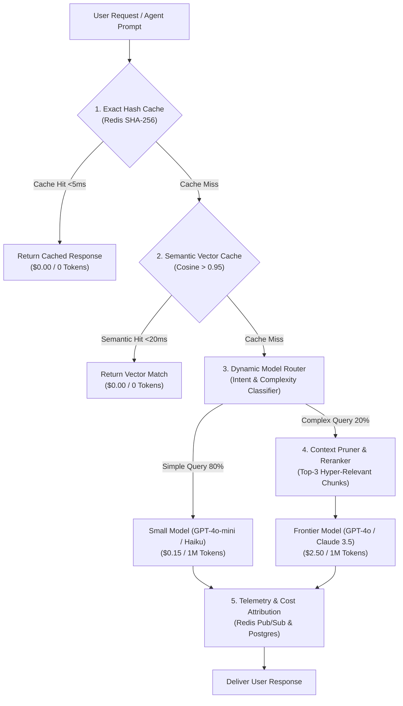

# 💰 Enterprise AI Cost Optimization & FinOps Guide
## Comprehensive Architectural Blueprint for LLM Token, Infrastructure & RAG Cost Reduction

---

## 📋 Executive Summary & Cost Reduction Matrix

As AI platforms scale from initial prototypes to high-throughput enterprise production workloads, LLM API tokens and GPU infrastructure costs often become the largest line-item operational expense. 

This guide outlines **8 proven architectural strategies** to reduce operational costs by **50% to 80%** while preserving response accuracy, latency SLAs, and system reliability.

| Strategy | Primary Cost Target | Potential Savings | Latency Impact | Implementation Complexity |
| :--- | :--- | :---: | :---: | :---: |
| **1. Model Cascading & Dynamic Routing** | API Tokens | **60% – 80%** | ⚡ 50% Faster (SLM) | Medium |
| **2. Multi-Tiered Caching (Exact + Semantic)** | API Tokens | **30% – 50%** | ⚡ `<10ms` (Instant) | Low |
| **3. Two-Stage RAG & Context Pruning** | Input Tokens | **40% – 60%** | ⚡ Faster TTFT | Medium |
| **4. Asynchronous Batch APIs** | API Tokens | **50% (Flat)** | 🐢 Async (up to 24h) | Low |
| **5. Domain SLM Fine-Tuning (LoRA/QLoRA)** | API Tokens | **80% – 90%** | ⚡ 3x Faster | High |
| **6. Self-Hosted vLLM Infrastructure** | Cloud GPU Compute | **50% – 70%** | ⚡ 24x Throughput | High |
| **7. Agent Loop Guardrails & Token Caps** | Runaway Loops | **Prevent Spikes** | N/A | Low |
| **8. Real-Time Telemetry & FinOps Attribution** | Platform Billing | Full Visibility | N/A | Medium |

---

## 📐 Enterprise FinOps Architectural Pipeline



---

## 🎯 1. Model Cascading & Dynamic Routing

### Concept
Up to 80% of enterprise agent queries (classification, simple extraction, standard customer support) do not require top-tier frontier models like `GPT-4o` or `Claude 3.5 Sonnet`. Routing all traffic to high-tier models incurs excessive token costs.

### Implementation Architecture
Implement a two-tier routing engine:
1. **Tier 1 (Small Language Model - SLM)**: Process incoming prompts with lightweight, cost-efficient models (`GPT-4o-mini`, `Claude 3 Haiku`, or local `Llama-3.1-8B`) at **~1/20th of the cost**.
2. **Tier 2 (Frontier Model)**: Escalate to top-tier models only when confidence metrics fail, or when the query involves complex code generation, mathematical reasoning, or multi-step logic.

```python
# Conceptual Dynamic Router Implementation
def route_and_execute(prompt: str, user_id: str):
    # Quick intent classification via fast regex or micro-SLM
    complexity_score = evaluate_query_complexity(prompt)
    
    if complexity_score < 0.6:
        # Route to SLM ($0.15 / 1M tokens)
        return call_llm(model="gpt-4o-mini", prompt=prompt)
    else:
        # Route to Frontier LLM ($2.50 / 1M tokens)
        return call_llm(model="gpt-4o", prompt=prompt)
```

---

## ⚡ 2. Multi-Tiered Caching (Exact + Semantic Caching)

### Concept
Repeated user queries or common agent system prompts consume unnecessary API tokens. A dual-layer cache captures identical and semantically equivalent queries before they reach external LLM endpoints.

### Dual-Layer Cache Strategy
1. **Exact Match Hash Cache**: Hash the prompt string (`SHA-256`) and look up exact matches in Redis. Serves response in **<5ms** at **$0.00 token cost**.
2. **Semantic Vector Cache**: Compute query embedding and check vector similarity in Redis Vector Search or `pgvector`. If Cosine Similarity > `0.95`, return the previously generated response.

```text
Incoming Query ──> [ SHA-256 Hash ] ──(Hit: <5ms)──> Return Response ($0)
                        │ (Miss)
                        ▼
                [ Vector Search ] ──(Similarity > 0.95)──> Return Response ($0)
                        │ (Miss)
                        ▼
                [ Call LLM Endpoint ]
```

---

## 🔍 3. Two-Stage RAG & Context Pruning

### Concept
Stuffing 20–30 document chunks into an LLM prompt inflates input token costs exponentially and degrades generation quality due to the "Lost in the Middle" phenomenon.

### Optimization Workflow
1. **Coarse Retrieval**: Retrieve Top-50 candidate chunks using fast Dense Vector Search (`pgvector` / HNSW) + Sparse BM25.
2. **Cross-Encoder Reranking**: Pass candidate chunks through a Cross-Encoder Reranker (e.g., `Cohere Rerank` or `BGE-Reranker-v2`) to select only the **Top 3–5 hyper-relevant chunks**.
3. **Prompt Compression**: Apply AST pruning or `LLMLingua` token compression to strip filler words and redundant formatting from chunks before feeding them to the LLM.

```text
Raw Chunks (50 chunks / ~15,000 Tokens)
   │
   ▼  [ Cross-Encoder Reranker ]
Top 3 Chunks (~1,200 Tokens)
   │
   ▼  [ Token Compression / Pruning ]
Final Context Payload (~600 Tokens)  <-- 95% Token Reduction!
```

---

## 📦 4. Asynchronous Batch APIs for Offline Workloads

### Concept
For workloads that do not require instant sub-second responses (e.g., nightly batch evaluation, offline document indexing, dataset generation, or analytical extraction), LLM providers offer dedicated batch endpoints.

### Key Benefits
* **50% Flat Discount**: OpenAI (`POST /v1/batches`) and Anthropic Message Batches offer a **50% discount** on input and output tokens.
* **Higher Rate Limits**: Separate quota pools prevent rate-limiting standard production traffic.
* **Completion Window**: Guaranteed execution within 24 hours (usually completed in 15–45 minutes).

---

## 🧬 5. Domain SLM Fine-Tuning (LoRA / QLoRA)

### Concept
Rather than using a 70B+ parameter generalist LLM for structured task extraction, train a 7B or 8B parameter open-weights model on specialized company datasets.

### Implementation Blueprint
1. Collect 1,000–5,000 high-quality input/output pairs from production logs.
2. Fine-tune `Llama-3.1-8B` or `Mistral-7B` using **Parameter-Efficient Fine-Tuning (PEFT / QLoRA)** in 4-bit precision.
3. Deploy the resulting adapter (.bin) onto local inference servers. A fine-tuned 8B model routinely matches or exceeds GPT-4 performance on specific domain tasks while slashing token costs by **90%**.

---

## ⚙️ 6. Self-Hosted Infrastructure & vLLM Optimizations

When serving open-source models on AWS EKS or cloud GPU instances:

### 1. PagedAttention & Prefix Caching
* **PagedAttention**: Manages KV-cache memory efficiently like virtual memory in operating systems, increasing GPU throughput by **24x**.
* **Prefix Caching**: Automatically reuses KV-cache allocations for identical system prompts across multiple concurrent user requests.

### 2. GPU Model Quantization
* Convert FP16 model weights to **AWQ (Activation-aware Weight Quantization)** or **FP8/INT4**.
* Reduces GPU VRAM requirements by **50% to 75%**, allowing models to run on single L4/A10G GPUs instead of multi-GPU A100/H100 clusters.

---

## 🛡️ 7. Agent Loop Guardrails & Runaway Protection

Autonomous agent frameworks (ReAct, LangGraph) can enter infinite loops when tool executions fail, consuming tens of thousands of tokens per minute.

### Safeguard Rules
1. **Max Iteration Cap**: Enforce hard execution limits (`max_iterations = 5`).
2. **Tool Output Truncation**: Sanitize and truncate large database or API returns before injecting them back into the LLM context window (e.g., limit SQL outputs to 10 rows).
3. **FSM Guided Decoding**: Enforce JSON schema validation via Instructor / Pydantic / Outlines to prevent conversational fluff and stop token leakage.

---

## 📊 8. Real-Time Telemetry & FinOps Attribution

You cannot optimize what you do not measure.

### FinOps Dashboard Requirements
* **Cost Per Project / Agent / User**: Track token spend per API key and customer tenant.
* **Latency vs. Cost Tradeoff**: Monitor Time-To-First-Token (TTFT) and Inter-Token-Latency (ITL) relative to model cost.
* **Automated Quotas & Rate Limits**: Set soft and hard monthly spending limits per project API key.

---

## 📋 FinOps Implementation Action Plan

1. **Week 1 (Quick Wins)**:
   * Enforce `max_tokens` limits across all prompt templates.
   * Enable Redis Exact Hash Caching for common static queries.
   * Migrate non-real-time pipelines to OpenAI Batch APIs.

2. **Week 2 (Model & RAG Optimization)**:
   * Introduce Model Cascading (route simple queries to `GPT-4o-mini`).
   * Implement Cross-Encoder Reranking to trim RAG context from 20 chunks to Top-3 chunks.

3. **Week 3–4 (Advanced Infrastructure)**:
   * Set up Semantic Vector Caching with pgvector / Redis VSS.
   * Evaluate vLLM self-hosting with AWQ quantization for high-volume endpoints.
   * Establish real-time telemetry cost monitoring dashboards and project budget caps.
