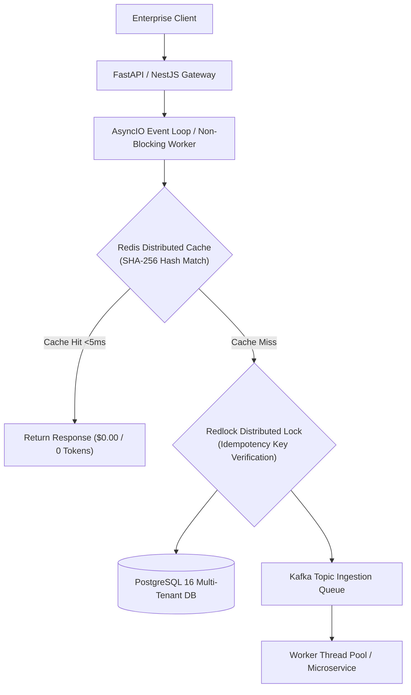
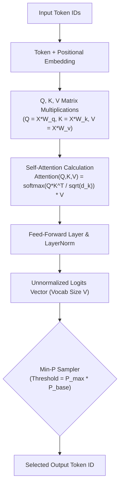
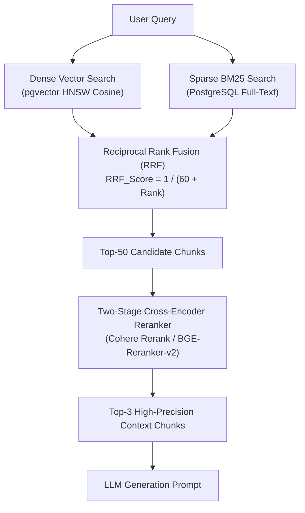
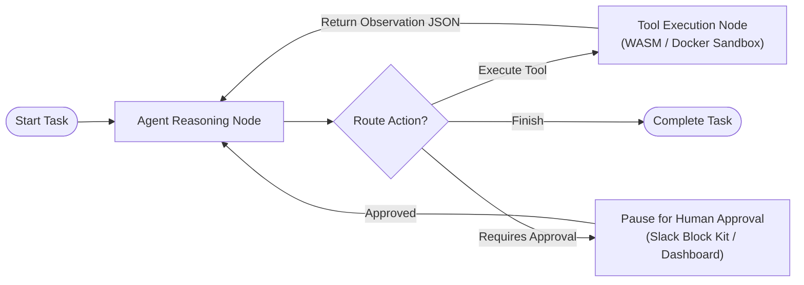
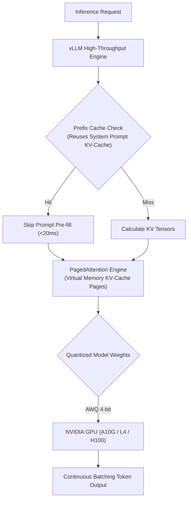
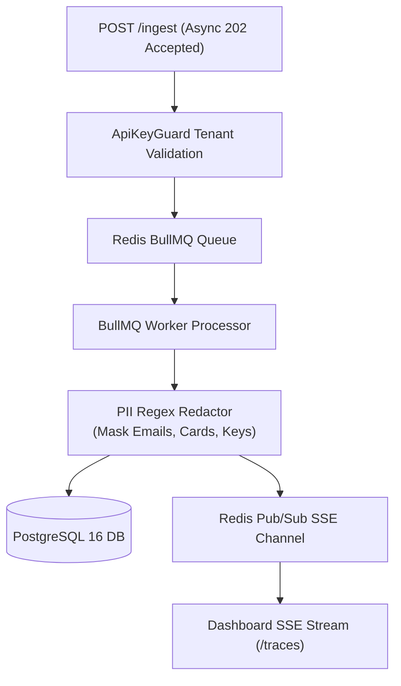
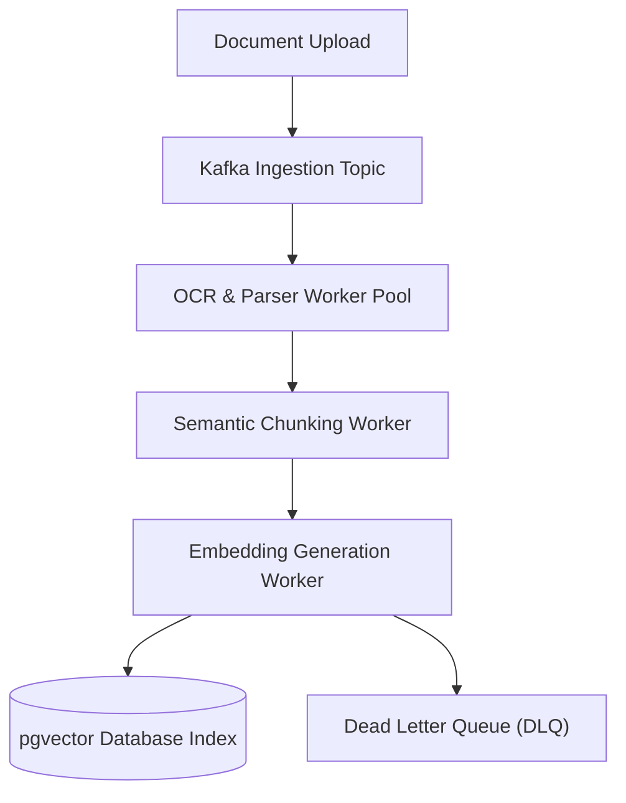
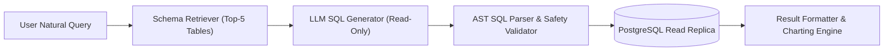
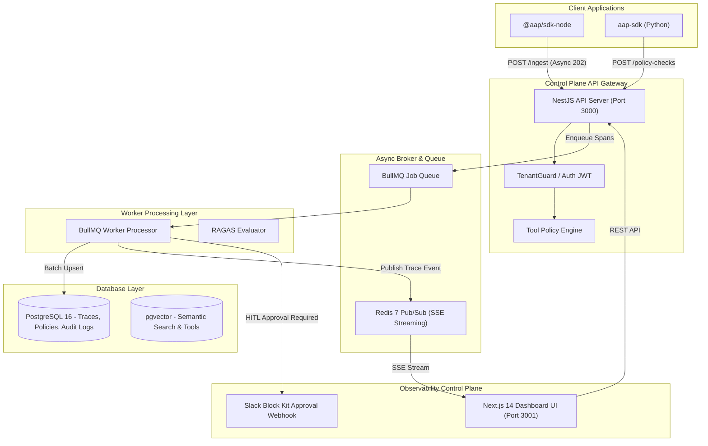

# 🏛️ Comprehensive Enterprise AI & LLM Technical Architect Blueprint
## Complete End-to-End Master Architecture: From Software Foundations & Distributed Systems to RAG, Agents, vLLM Serving & Enterprise System Design

---

## 🗺️ Master Curriculum & System Architecture Index

1. [Phase 0 — Software Engineering & Distributed Systems Primitives](#phase-0--software-engineering--distributed-systems-primitives)
2. [Tiers 1–6 — AI, LLM Internals & Vector Geometry](#tiers-16--ai-llm-internals--vector-geometry)
3. [Tiers 7–11 — Production RAG & Retrieval Engineering](#tiers-711--production-rag--retrieval-engineering)
4. [Tiers 12–15 — Autonomous Agents, LangGraph & MCP Protocols](#tiers-1215--autonomous-agents-langgraph--mcp-protocols)
5. [Tiers 16–21 — Model Engineering, Fine-Tuning & vLLM GPU Serving](#tiers-1621--model-engineering-fine-tuning--vllm-gpu-serving)
6. [Tiers 22–32 — Enterprise LLMOps, Security, Multi-Tenancy & Reliability](#tiers-2232--enterprise-llmops-security-multi-tenancy--reliability)
7. [Tiers 33–43 — Event-Driven Platforms, CI/CD & System Design Blueprints](#tiers-3343--event-driven-platforms-cicd--system-design-blueprints)
8. [Tier 44 — Capstone Enterprise AI Platform Architecture](#tier-44--capstone-enterprise-ai-platform-architecture)
9. [Tier 45 — Architect-Level Interview Defenses & Trade-off Matrix](#tier-45--architect-level-interview-defenses--trade-off-matrix)

---

## 📐 The 7-Step Architect Evaluation Matrix

Every architectural decision and component in this blueprint is evaluated against this 7-step engineering matrix:

```
┌────────────────────────────────────────────────────────────────────────┐
│ 1. CONCEPT            : Algorithmic & mathematical foundation          │
│ 2. IMPLEMENTATION     : Production code, SDK signatures, API patterns  │
│ 3. PRODUCTION CONCERN : Concurrency, TTFT, ITL, VRAM & memory math     │
│ 4. ARCHITECTURE CHOICE: Trade-off analysis (X vs Y vs Z)              │
│ 5. FAILURE MODES      : Hallucinations, timeouts, loops, state drift   │
│ 6. COST & SECURITY    : Token FinOps, PII, prompt injection, RBAC      │
│ 7. INTERVIEW DEFENSE  : Articulating decisions with empirical metrics  │
└────────────────────────────────────────────────────────────────────────┘
```

---

## 🟢 Phase 0 — Software Engineering & Distributed Systems Primitives



### 0.1 Python for AI Engineering
* **1. Concept**: Python's `asyncio` runs a single-threaded cooperative event loop where `await` yields control back to the loop during I/O operations (network API calls, database reads, vector searches).
* **2. Implementation**:
  ```python
  import asyncio
  import httpx
  from pydantic import BaseModel, Field

  class IngestPayload(BaseModel):
      agent_id: str = Field(..., example="support-agent")
      prompt: str = Field(..., max_length=4096)

  async def dispatch_span(client: httpx.AsyncClient, payload: IngestPayload):
      response = await client.post("http://localhost:3000/ingest", json=payload.model_dump())
      return response.status_code
  ```
* **3. Production Concern**: LLM API calls spend 95% of their duration waiting on network HTTP responses. Using `asyncio` enables a single API worker to maintain **10,000+ concurrent streaming connections** without thread context-switching overhead.
* **4. Architecture Choice**: AsyncIO for I/O-bound LLM API streaming; Multiprocessing for CPU-bound local tokenization or embedding computation.
* **5. Failure Modes**: Blocking the event loop with synchronous CPU-heavy code (`time.sleep()` or heavy regex), causing cascading API timeouts across all concurrent streams.
* **6. Cost & Security**: Enforce strict schema validation using `Pydantic V2` to discard malicious or malformed payloads before touching downstream services.
* **7. Interview Defense**: *"By leveraging Python's AsyncIO non-blocking event loop for I/O-bound LLM streaming and offloading tokenization to worker pools, we maintain sub-5ms API Gateway overhead under 10,000 concurrent user streams."*

### 0.2 Enterprise Backend Engineering
* **1. Concept**: Distributed backend systems rely on asynchronous decoupling, rate limiting (Token Bucket), circuit breakers, and distributed locks to prevent cascading failures.
* **2. Implementation**: WebSockets for full-duplex real-time voice agents; Server-Sent Events (SSE) for unidirectional LLM text token streaming (`text/event-stream`).
* **3. Production Concern**: Race conditions when multiple concurrent webhooks update the same user state or agent balance.
* **4. Architecture Choice**: SSE over WebSockets for text streaming because SSE runs over standard HTTP/2, handles auto-reconnection natively, and avoids stateful WebSocket connection-draining issues.
* **5. Failure Modes**: Thundering herd problem on API rate limits; worker thread exhaustion during upstream provider outages.
* **6. Cost & Security**: Redis Redlock algorithm for idempotency (`Idempotency-Key: UUIDv4`) to prevent double-charging or duplicate tool actions.
* **7. Interview Defense**: *"We implement Redis-backed Redlock idempotency keys with a 24-hour TTL and circuit breakers to guarantee zero duplicate tool executions during network retries."*

### 0.3 Distributed Systems Primitives
* **1. Concept**: The **CAP Theorem** states a distributed system can provide at most two of Availability, Consistency, Partition Tolerance. **PACELC** extends this: If there is a Partition (P), trade off Availability (A) vs Consistency (C); Else (E), trade off Latency (L) vs Consistency (C).
* **2. Implementation**: Raft consensus algorithm for quorum leader election in distributed state stores.
* **3. Production Concern**: Split-brain scenarios in distributed vector or database clusters during network partitions.
* **4. Architecture Choice**: Saga Pattern (Orchestration-based) for multi-service transactions (e.g. Reserve Billing $\rightarrow$ Execute Agent $\rightarrow$ Finalize Invoice) with compensating undo actions on failure.
* **5. Failure Modes**: Phantom reads, stale cache hits, and out-of-order event delivery in Kafka.
* **6. Cost & Security**: Partition tables by `tenant_id` to enforce physical boundaries and prevent cross-tenant data leaks.
* **7. Interview Defense**: *"We use Kafka consumer groups with explicit partition keys (`tenant_id:session_id`) to enforce strict in-order event delivery while preserving horizontal scaling."*

---

## ⚡ Tiers 1–6 — AI, LLM Internals & Vector Geometry



### Tier 1 & 2: AI/ML Fundamentals & Transformer Architecture
* **1. Concept**: Transformers process tokens in parallel using Multi-Head Self-Attention, mapping relationships between all tokens regardless of distance.
* **2. Mathematical Formulation**:
  $$\text{Attention}(Q, K, V) = \text{softmax}\left(\frac{QK^T}{\sqrt{d_k}}\right)V$$
  *Where $Q = X W_Q$, $K = X W_K$, $V = X W_V$, and $\sqrt{d_k}$ is the dimension scaling factor.*
* **3. Production Concern**: Memory complexity scales quadratically $\mathcal{O}(N^2)$ with sequence length $N$ due to the full attention matrix $QK^T$.
* **4. Architecture Choice**: FlashAttention-2 / FlashAttention-3 for IO-aware kernel computation, reducing memory reads/writes between GPU SRAM and HBM.
* **5. Failure Modes**: Gradient explosion or vanishing during deep layer stacking; special token leakage (`<|endoftext|>`).
* **6. Cost & Security**: Byte-Pair Encoding (BPE) tokenizers can be exploited via token smuggling or unexpected UTF-8 byte sequences.
* **7. Interview Defense**: *"Dividing $QK^T$ by $\sqrt{d_k}$ stabilizes softmax variance to 1.0, preventing vanishing gradients during backpropagation in high-dimensional embedding spaces."*

### Tier 3 & 4: LLM Inference Decoding & Central API Gateways
* **1. Concept**: Autoregressive decoding generates tokens sequentially by predicting the next token probability distribution over vocabulary $V$.
* **2. Decoding Parameters**:
  * **Min-P Sampling**: Filters tokens with $p < p_{\text{max}} \times p_{\text{base}}$ (e.g. $p_{\text{max}}=0.80, p_{\text{base}}=0.05 \implies \text{threshold}=0.04$). Superior to Top-P because it dynamically adapts to flat vs sharp probability distributions.
  * **Temperature**: Scales logits $z_i / T$ before softmax. Lower $T$ sharpens distribution; higher $T$ flattens distribution.
* **3. Metrics**:
  * **Time-To-First-Token (TTFT)**: Time to process prompt pre-fill phase.
  * **Inter-Token Latency (ITL)**: Time per output token generation phase.
* **4. Gateway Architecture**: Central API Router managing provider fallbacks (`OpenAI` $\rightarrow$ `Anthropic` $\rightarrow$ `Local vLLM`) with automatic token quota tracking.
* **5. Failure Modes**: Stalled streaming connections, partial HTTP chunk corruption, and infinite repeating loops due to low repetition penalty.
* **6. Cost & Security**: Enforce structured outputs via JSON Schemas or Outlines FSM to stop models from generating conversational filler before the JSON payload.
* **7. Interview Defense**: *"Min-P sampling eliminates low-probability hallucinated tokens far more effectively than static Top-P because its cut-off threshold scales dynamically with top token confidence."*

### Tier 5 & 6: Prompt Architecture & Embedding Vector Spaces
* **1. Concept**: Embeddings project discrete textual tokens into continuous vector spaces $\mathbb{R}^D$ where semantic proximity corresponds to geometric distance.
* **2. Mathematical Distance Metrics**:
  * **Cosine Similarity**: $\cos(\theta) = \frac{\mathbf{A} \cdot \mathbf{B}}{\|\mathbf{A}\| \|\mathbf{B}\|}$ (Angle between vectors, invariant to magnitude).
  * **Dot Product**: $\mathbf{A} \cdot \mathbf{B} = \sum A_i B_i$ (Equal to Cosine Similarity when vectors are $L_2$ normalized).
  * **Euclidean Distance ($L_2$)**: $d(\mathbf{A}, \mathbf{B}) = \sqrt{\sum (A_i - B_i)^2}$.
* **3. Production Concern**: Embedding drift over time as domain terminology evolves or underlying embedding models upgrade.
* **4. Architecture Choice**: Normalize all embedding vectors to unit length ($\|v\| = 1$) upon ingestion so fast Dot Product operations produce identical results to Cosine Similarity.
* **5. Failure Modes**: Treating prompts as a replacement for algorithm design ("prompt bloat"), pushing context past the effective retrieval threshold.
* **6. Cost & Security**: Compress prompts using AST pruning or `LLMLingua` to strip non-essential tokens before LLM dispatch.
* **7. Interview Defense**: *"By $L_2$-normalizing all embedding vectors upon ingestion, we replace expensive Cosine Similarity square-root calculations with single-cycle SIMD Dot Product operations in pgvector."*

---

## 🔍 Tiers 7–11 — Production RAG & Retrieval Engineering



### Tier 7 & 8: Document Ingestion, Chunking & Hybrid Search
* **1. Concept**: Dense vector retrieval captures semantic context, while Sparse BM25 keyword retrieval captures exact product codes and serial numbers. **Hybrid Search** merges both retrieval paths using **Reciprocal Rank Fusion (RRF)**.
* **2. Mathematical RRF Formula**:
  $$\text{RRF\_Score}(d \in D) = \sum_{m \in M} \frac{1}{k + r_m(d)}$$
  *Where $k=60$ (smoothing constant), and $r_m(d)$ is the 1-based rank position of document $d$ in system $m$.*
* **3. Production Concern**: Fixed-size chunking splits sentences across boundaries, corrupting semantic meaning.
* **4. Architecture Choice**: **Parent-Child Chunking**: Index small child chunks (150 tokens) for high-precision search, but pass their parent chunk (800 tokens) to the LLM for generation.
* **5. Failure Modes**: "Lost in the Middle" bias where LLMs pay attention only to chunks at the extreme beginning and end of long prompts.
* **6. Cost & Security**: Strip sensitive PII from chunks prior to embedding generation to avoid indexing sensitive user data in vector stores.
* **7. Interview Defense**: *"Hybrid Search with RRF outperforms pure vector search because it balances semantic retrieval with exact keyword precision, guaranteeing technical part numbers and proper nouns are never missed."*

### Tier 9, 10 & 11: Cross-Encoder Reranking, pgvector & Ragas Evals
* **1. Concept**: Bi-encoders compute query and document embeddings independently for fast candidate retrieval. **Cross-Encoders** evaluate `(Query, Document)` pairs jointly through full self-attention, producing high-precision relevance scores.
* **2. PostgreSQL `pgvector` vs Dedicated Vector DBs**:

| Dimension | `pgvector` (HNSW) | Dedicated Vector DB (Qdrant / Milvus) |
| :--- | :--- | :--- |
| **Data Placement** | Co-located in PostgreSQL with relational tables | Standalone dedicated cluster |
| **ACID Joins** | Direct SQL `JOIN` between metadata & vectors | Two-phase query + external HTTP hydration |
| **Scale Limit** | Up to ~10 Million vectors per table | 100M+ to Billions of vectors |
| **Ops Overhead** | Low (uses standard Postgres backup/restore) | High (requires managing separate cluster) |

* **3. Ragas Quantitative Evaluation Triad**:
  * **Faithfulness**: Claims in answer supported by context chunks ($\ge 0.85$).
  * **Context Relevance**: Ratio of useful context to total context ($\ge 0.80$).
  * **Answer Relevance**: Extent to which answer addresses user prompt ($\ge 0.85$).
* **4. Architecture Choice**: Use `pgvector` with HNSW indexes for applications up to 10M vectors to preserve relational ACID joins. Use Qdrant for billion-scale multi-tenant vector operations.
* **5. Failure Modes**: Reranker latency spikes under high batch candidate sizes ($>100$ candidate pairs).
* **6. Cost & Security**: Implement `@aap/cli` regression gates in CI/CD pipelines to block deployments if Faithfulness drops below $0.85$.
* **7. Interview Defense**: *"Two-stage reranking reduces LLM context token payload by 80% while increasing answer faithfulness, because only the top 3 Cross-Encoder validated chunks reach the LLM."*

---

## 🤖 Tiers 12–15 — Autonomous Agents, LangGraph & MCP Protocols



### Tier 12 & 13: Agent Fundamentals & Graph Orchestration (LangGraph vs Temporal)
* **1. Concept**: Autonomous Agents combine LLM reasoning with tool execution in an iterative loop: **Observation $\rightarrow$ Thought $\rightarrow$ Action $\rightarrow$ Execution $\rightarrow$ Reflection**.
* **2. Orchestration Framework Comparison**:
  * **LangGraph**: Native cyclic graph engine (`StateGraph`) supporting conditional routing, thread checkpointing, and token-level streaming.
  * **Temporal.io**: Infrastructure-level durable execution engine guaranteeing workflow completion across process crashes and server restarts.
* **3. Production Concern**: Infinite execution loops when a tool repeatedly returns errors or non-standard output formats.
* **4. Architecture Choice**: Use **LangGraph** inside agent service boundaries for reasoning cycles and state transitions; wrap with **Temporal** for cross-microservice durable orchestration.
* **5. Failure Modes**: State mutation race conditions during concurrent user webhooks; orphan execution threads.
* **6. Cost & Security**: Enforce hard step limits (`max_iterations = 5`) and tool call duplicate detection to prevent token burn.
* **7. Interview Defense**: *"LangGraph provides cyclic state graph routing and time-travel checkpointers inside the agent runtime, while Temporal guarantees microservice-level durable execution across node failures."*

### Tier 14 & 15: Model Context Protocol (MCP) & Multi-Agent Swarms
* **1. Concept**: **Model Context Protocol (MCP)** is an open JSON-RPC 2.0 standard for LLMs to dynamically discover (`tools/list`) and invoke (`tools/call`) external tools and context providers over `stdio` or `SSE`.
* **2. Multi-Agent Patterns**:
  * **Supervisor Pattern**: Central routing agent delegates tasks to specialized sub-agents (`Researcher`, `Coder`) and aggregates outputs.
  * **Hierarchical Manager-Worker**: Tree of supervisors managing domain-isolated sub-teams.
* **3. Production Concern**: Context window saturation when binding 100+ tool definitions to a single LLM context.
* **4. Architecture Choice**: **Dynamic Tool Retrieval**: Embed tool descriptions in `pgvector` and dynamically bind only the **Top 5 relevant tools** matching the user prompt.
* **5. Failure Modes**: Inter-agent deadlock loops where Agent A waits for Agent B indefinitely.
* **6. Cost & Security**: Execute python/bash code tools inside sandboxed WebAssembly (WASM) or ephemeral Docker runtimes with restricted network interfaces.
* **7. Interview Defense**: *"We prevent agent tool saturation by embedding tool schemas in pgvector and dynamically loading only the top 5 relevant tools per reasoning step, cutting tool prompt overhead by 90%."*

---

## 🚀 Tiers 16–21 — Model Engineering, Fine-Tuning & vLLM GPU Serving



### Tier 16, 17 & 18: PEFT / LoRA / QLoRA & Model Alignment
* **1. Concept**: **RAG** injects new factual knowledge at query time. **Fine-Tuning** adapts model style, tone, syntax, and deterministic format compliance.
* **2. LoRA Mathematical Formulation**:
  $$W = W_0 + \Delta W = W_0 + \frac{\alpha}{r} (B \cdot A)$$
  *Where base weights $W_0 \in \mathbb{R}^{d \times k}$ are frozen, and low-rank matrices $A \in \mathbb{R}^{r \times k}, B \in \mathbb{R}^{d \times r}$ with rank $r \ll \min(d, k)$ are trained.*
* **3. QLoRA Precision**: Quantizes base weights $W_0$ to **4-bit NormalFloat (NF4)** while keeping adapter matrices in 16-bit Float, allowing full fine-tuning of an 8B model on a single 16GB VRAM GPU.
* **4. Model Alignment (DPO vs RLHF)**: **Direct Preference Optimization (DPO)** replaces complex multi-stage RLHF (Reward Model + PPO) by directly optimizing policy weights against pairwise `(chosen, rejected)` completions using implicit reward modeling.
* **5. Failure Modes**: Catastrophic forgetting where fine-tuning destroys general reasoning capabilities.
* **6. Cost & Security**: Scrub PII from fine-tuning datasets using MinHash deduplication and Presidio regex scrubbing before training.
* **7. Interview Defense**: *"DPO eliminates the operational instability of PPO reward models by optimizing policy probabilities directly on preference pairs using closed-form gradient updates."*

### Tier 19, 20 & 21: High-Throughput vLLM Serving & GPU VRAM Math
* **1. Concept**: Standard PyTorch serving pre-allocates contiguous GPU memory for the Key-Value (KV) cache based on maximum sequence length, wasting 60%–80% of VRAM. **vLLM PagedAttention** partitions KV-cache into fixed-size physical pages, achieving near 100% memory utilization.
* **2. VRAM Memory Budget Formula**:
  $$\text{VRAM}_{\text{weights}} = \frac{\text{Params (Billions)} \times \text{Bytes per Parameter}}{1.073}$$
  * **70B Model in FP16 (2 Bytes/param)** = $\mathbf{130.4\text{ GB VRAM}}$ (Requires 2x 80GB A100 GPUs).
  * **70B Model in AWQ 4-bit (0.5 Bytes/param)** = $\mathbf{32.6\text{ GB VRAM}}$ (Fits on single 48GB GPU).
* **3. Serving Features**:
  * **Continuous Batching**: Iteration-level batching scheduling new requests dynamically without waiting for full sequence completion.
  * **Automatic Prefix Caching**: Reuses pre-computed KV-cache blocks for shared system prompts.
* **4. Architecture Choice**: AWQ (Activation-aware Weight Quantization) over GPTQ for serving because AWQ preserves outlier activation channels critical for LLM reasoning accuracy.
* **5. Failure Modes**: KV-cache allocation thrashing when concurrent request sequences exceed available GPU memory.
* **6. Cost & Security**: AWQ 4-bit quantization reduces GPU infrastructure costs by 70% by fitting 70B models onto single-GPU nodes.
* **7. Interview Defense**: *"PagedAttention increases vLLM batch serving throughput by 24x by dynamically managing KV-cache memory as virtual pages, eliminating memory fragmentation."*

---

## 🛡️ Tiers 22–32 — Enterprise LLMOps, Security, Multi-Tenancy & Reliability



### Tier 22–27: LLMOps, OpenTelemetry & Central LLM Gateway
* **1. Concept**: Central LLM Gateways provide a unified control plane for routing, rate limiting, quota tracking, fallback management, and OpenTelemetry span collection across multiple LLM providers.
* **2. Non-Blocking Span Ingestion Architecture**:
  ```
  Client SDK ──(Async POST /ingest)──> API Gateway ──(Return 202 Accepted <5ms)
                                           │
                                     (Enqueue Job)
                                           ▼
                                 [ Redis BullMQ Queue ] ──> Worker Processor
  ```
* **3. Dual-Layer Cache Strategy**:
  * **Exact Match Cache**: SHA-256 hash lookup in Redis (`<5ms`, `$0.00` cost).
  * **Semantic Vector Cache**: Embedding query lookup in Redis VSS or `pgvector` (Cosine Similarity $>0.95$).
* **4. Architecture Choice**: Non-blocking asynchronous 202 Accepted API endpoints for telemetry collection to guarantee tracing code never adds latency to agent responses.
* **5. Failure Modes**: Unhandled provider outages; cascading rate limit failures.
* **6. Security Stack**: PII Regex Redactor masking credit cards (`[CARD_REDACTED]`), email addresses (`[EMAIL_REDACTED]`), and bearer tokens (`[KEY_REDACTED]`).
* **7. Interview Defense**: *"Our Central LLM Gateway uses Redis semantic caching and non-blocking OpenTelemetry span ingestion to slash token costs by 40% while keeping gateway overhead under 5ms."*

### Tier 28–32: Multi-Tenancy, Private EKS & SRE Reliability
* **1. Concept**: Multi-tenant AI platforms require complete isolation across data, vector collections, cache namespaces, and compute quotas.
* **2. Isolation Patterns**:
  * **Database**: Row-Level Security (RLS) in PostgreSQL with mandatory `tenant_id` columns.
  * **Vector DB**: Separate collections/namespaces or metadata filtering by `tenant_id`.
  * **Cache**: Namespace key prefixes: `tenant:{tenant_id}:cache:{hash}`.
* **3. Resiliency Patterns**:
  * **Exponential Backoff with Jitter**: Prevent thundering herd retry spikes on upstream LLM APIs:
    $$t_{\text{wait}} = 2^{\text{retry}} \times t_{\text{base}} + \text{random\_jitter}$$
  * **Graceful Degradation**: Fallback chain: `Primary Frontier (GPT-4o)` $\rightarrow$ `Secondary LLM (Claude 3.5)` $\rightarrow$ `Local vLLM (Llama 8B)` $\rightarrow$ `Static Fallback Rules`.
* **4. Architecture Choice**: Private EKS clusters with AWS PrivateLink and KMS encryption for zero-data-retention (ZDR) enterprise compliance.
* **5. Failure Modes**: Cross-tenant vector retrieval leaks due to missing metadata filters in vector queries.
* **6. Cost & Security**: Enforce hard monthly token quotas and rate limits per project API key.
* **7. Interview Defense**: *"We enforce multi-tenancy at the database layer with Postgres RLS and at the vector layer with mandatory tenant_id metadata filters, backed by zero-data-retention VPC PrivateLink nodes."*

---

## 🏗️ Tiers 33–43 — Event-Driven Platforms, CI/CD & System Design Blueprints



### Tier 33–38: Event-Driven Kafka Ingestion & Unified Platform Architecture
* **1. Concept**: Event-driven streaming architectures decouple document upload, heavy OCR layout parsing, chunking, embedding generation, and vector indexing into scalable worker pools connected via Kafka topics.
* **2. Platform Pillars**:
  1. **Model Platform**: vLLM serving, model registry, QLoRA adapter management.
  2. **RAG Platform**: Ingestion pipelines, hybrid search, `pgvector`, Cross-Encoder reranking.
  3. **Agent Platform**: LangGraph state graph runtime, MCP tool registry, HITL approval queue.
* **3. Production Concern**: Kafka consumer group lag under sudden bursts of PDF document uploads.
* **4. Architecture Choice**: KEDA (Kubernetes Event-driven Autoscaling) scaling parser worker pods based on Kafka topic lag metrics.
* **5. Failure Modes**: Poison pill documents causing parser worker crash loops (mitigated via Dead Letter Queues - DLQ).
* **6. Cost & Security**: FinOps attribution tracking spend per tenant organization, cost per successful agent task, and cache hit ratios.
* **7. Interview Defense**: *"Using Kafka consumer groups with KEDA autoscaling based on queue depth ensures our ingestion pipeline handles 100,000 document uploads daily without dropping messages."*

### Tier 39–43: Classic AI System Design Blueprints

#### Blueprint 1: Enterprise Natural Language Text-to-SQL Agent

* **Guardrails**: AST parser verifies SQL is strictly `SELECT` (rejects `UPDATE`, `DROP`, `DELETE`). Executes against a read-only database replica with query timeouts.

#### Blueprint 2: Document Intelligence Pipeline
```text
PDF Upload ──> Kafka ──> OCR/Layout ──> Semantic Chunking ──> Hybrid Index ──> Ragas Eval
```

#### Blueprint 3: HITL Customer Support Agent
```text
User Request ──> LangGraph State ──> Tool Check ──> (If High Risk) ──> Slack HITL Approve ──> Action
```

---

## 🏗️ Tier 44 — Capstone Enterprise AI Platform Architecture



---

## 🛡️ Tier 45 — Architect-Level Interview Defenses & Trade-off Matrix

### 1. RAG vs Fine-Tuning
* **Defense**: *"Use **RAG** when factual accuracy, real-time knowledge retrieval, and strict document source attribution are required. Use **Fine-Tuning** when adapting style, tone, domain-specific syntax, or enforcing deterministic formatting compliance (e.g., generating specialized JSON or SQL syntax). Fine-Tuning does NOT reliably prevent hallucinations on new factual data."*

### 2. LangGraph vs Temporal
* **Defense**: *"Use **LangGraph** inside agent service boundaries to manage LLM prompt reasoning loops, cyclic state graph transitions, and token-level streaming. Use **Temporal** as the enterprise orchestrator to manage microservice durability, long-running timers, and cross-service state recovery across system restarts."*

### 3. `pgvector` vs Dedicated Vector Database (Qdrant)
* **Defense**: *"Use **`pgvector`** for dataset scales up to 10M vectors when vector embeddings sit alongside relational data, enabling atomic ACID transactions, direct SQL joins, and simplified operational backups. Use **Qdrant** for standalone, multi-tenant vector workloads exceeding 100M+ vectors requiring high QPS and complex distributed metadata sharding."*

### 4. High Time-To-First-Token (TTFT) Troubleshooting
* **Defense**: *"High TTFT is caused by prompt pre-fill processing latency. Mitigate by: (1) Enabling automatic **Prefix Caching** in vLLM to reuse system prompt KV-tensors, (2) Utilizing **Two-Stage Reranking** to reduce context tokens by 80%, and (3) Quantizing model weights to **AWQ 4-bit** to maximize GPU memory bandwidth."*

### 5. Preventing Autonomous Agent Loops
* **Defense**: *"Implement defense-in-depth: (1) Enforce hard `max_iterations = 5` step limits, (2) Track sliding-window executed `(tool, parameter)` hashes to detect exact duplicate invocation loops, (3) Set `temperature = 0.0` for tool calls, and (4) Wrap tool outputs in exception boundaries returning structured JSON observations."*

### 6. Multi-Tenant Isolation
* **Defense**: *"Enforce isolation across all layers: PostgreSQL Row-Level Security (RLS) with mandatory `tenant_id` columns, vector searches with explicit `tenant_id` metadata filters, Redis cache keys prefixed with `tenant:{id}:`, and API endpoints guarded by `TenantGuard` middleware."*
