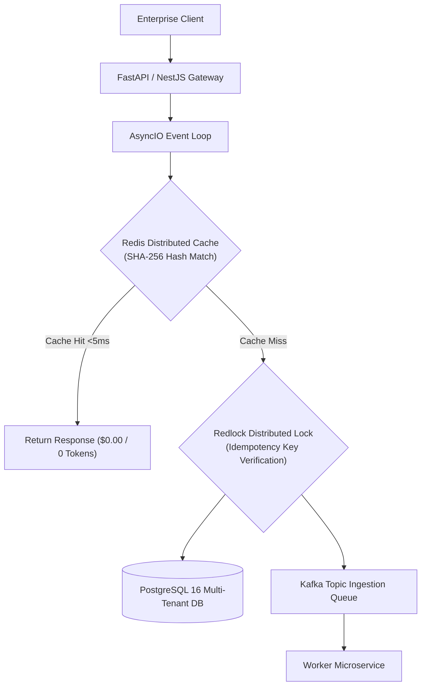
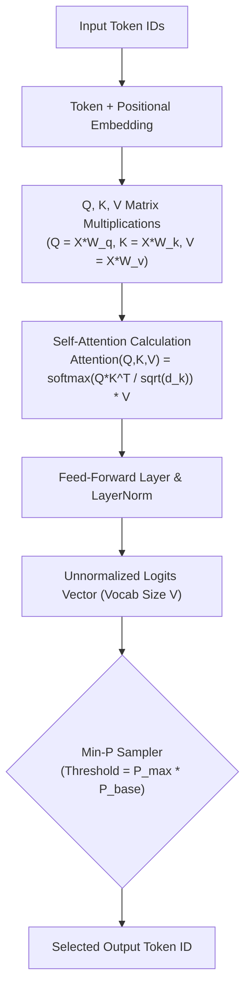
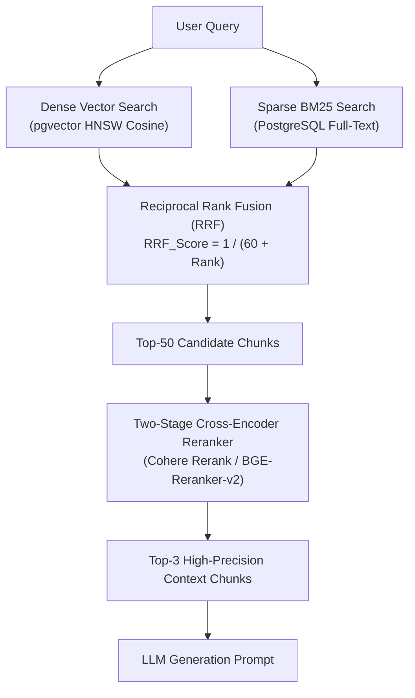
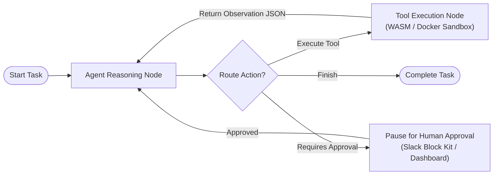
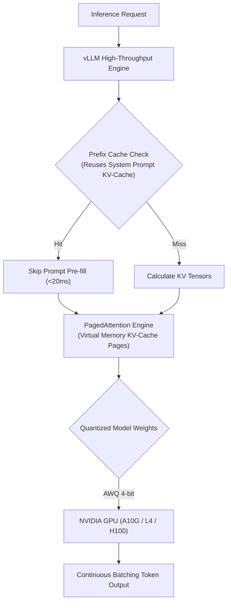
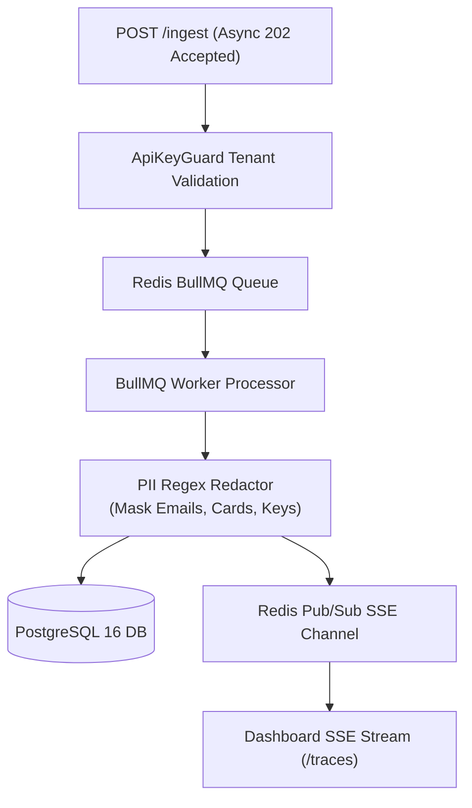
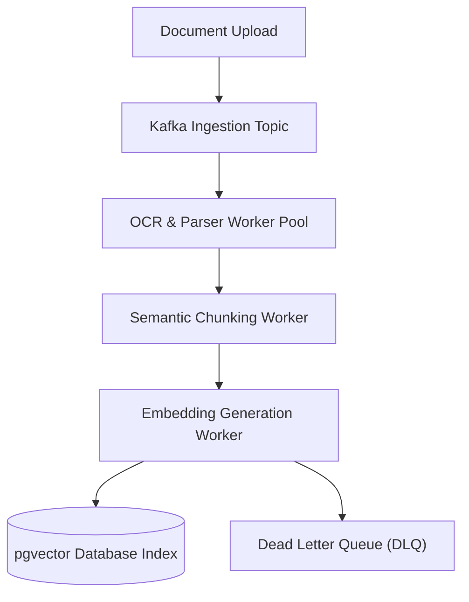
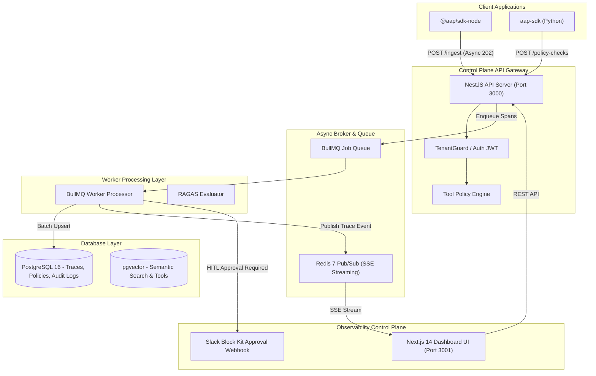

# 🏛️ Full Master AI & LLM Systems Architect Blueprint (Tiers 1 – 45 Complete)
## Exhaustive Tier-by-Tier Architecture, Mathematical Formulas, Production Code & System Designs

---

## 🗺️ Master Curriculum Index

* [Phase 0: Engineering & Distributed Systems Foundation](#phase-0--engineering--distributed-systems-foundation)
  * [0.1 Python for AI Engineering](#01-python-for-ai-engineering)
  * [0.2 Enterprise Backend Engineering](#02-enterprise-backend-engineering)
  * [0.3 Distributed Systems Primitives](#03-distributed-systems-primitives)
* [Stage 1: AI, LLM Internals & Vector Geometry (Tiers 1–6)](#stage-1-ai-llm-internals--vector-geometry-tiers-16)
  * [Tier 1: AI/ML Fundamentals & Tensor Math](#tier-1-aiml-fundamentals--tensor-math)
  * [Tier 2: Transformer & Multi-Head Self-Attention Internals](#tier-2-transformer--multi-head-self-attention-internals)
  * [Tier 3: LLM Inference Decoding Parameters & Metrics](#tier-3-llm-inference-decoding-parameters--metrics)
  * [Tier 4: LLM API Engineering & Gateway Pipelines](#tier-4-llm-api-engineering--gateway-pipelines)
  * [Tier 5: Advanced Prompt Architecture & Compression](#tier-5-advanced-prompt-architecture--compression)
  * [Tier 6: Embeddings & Mathematical Vector Spaces](#tier-6-embeddings--mathematical-vector-spaces)
* [Stage 2: Production RAG & Retrieval Engine (Tiers 7–11)](#stage-2-production-rag--retrieval-engine-tiers-711)
  * [Tier 7: Document Ingestion, Multi-Modal Parsers & Chunking](#tier-7-document-ingestion-multi-modal-parsers--chunking)
  * [Tier 8: Hybrid Search & Reciprocal Rank Fusion (RRF)](#tier-8-hybrid-search--reciprocal-rank-fusion-rrf)
  * [Tier 9: Two-Stage Cross-Encoder Reranking](#tier-9-two-stage-cross-encoder-reranking)
  * [Tier 10: Vector Databases & PostgreSQL pgvector](#tier-10-vector-databases--postgresql-pgvector)
  * [Tier 11: Quantitative RAG Evaluation (Ragas Triad)](#tier-11-quantitative-rag-evaluation-ragas-triad)
* [Stage 3: Autonomous Agents, LangGraph & MCP Protocols (Tiers 12–15)](#stage-3-autonomous-agents-langgraph--mcp-protocols-tiers-1215)
  * [Tier 12: Autonomous Agent Reasoning Loops](#tier-12-autonomous-agent-reasoning-loops)
  * [Tier 13: Agent State & Graph Orchestration (LangGraph vs Temporal)](#tier-13-agent-state--graph-orchestration-langgraph-vs-temporal)
  * [Tier 14: Model Context Protocol (MCP) & Sandboxing](#tier-14-model-context-protocol-mcp--sandboxing)
  * [Tier 15: Multi-Agent Swarms & Supervisor Patterns](#tier-15-multi-agent-swarms--supervisor-patterns)
* [Stage 4: Model Engineering, Serving & GPU VRAM Math (Tiers 16–21)](#stage-4-model-engineering-serving--gpu-vram-math-tiers-1621)
  * [Tier 16: Parameter-Efficient Fine-Tuning (PEFT / LoRA / QLoRA)](#tier-16-parameter-efficient-fine-tuning-peft--lora--qlora)
  * [Tier 17: Dataset Engineering & Synthetic Data Pipelines](#tier-17-dataset-engineering--synthetic-data-pipelines)
  * [Tier 18: Model Alignment (DPO vs RLHF)](#tier-18-model-alignment-dpo-vs-rlhf)
  * [Tier 19: High-Throughput vLLM Serving & PagedAttention](#tier-19-high-throughput-vllm-serving--pagedattention)
  * [Tier 20: Model Quantization (AWQ / GPTQ / FP8)](#tier-20-model-quantization-awq--gptq--fp8)
  * [Tier 21: GPU Hardware Architecture & VRAM Math](#tier-21-gpu-hardware-architecture--vram-math)
* [Stage 5: Enterprise LLMOps, Gateways & Security (Tiers 22–32)](#stage-5-enterprise-llmops-gateways--security-tiers-2232)
  * [Tier 22: End-to-End LLMOps Lifecycle](#tier-22-end-to-end-llmops-lifecycle)
  * [Tier 23: OpenTelemetry Tracing & Observability](#tier-23-opentelemetry-tracing--observability)
  * [Tier 24: Centralized LLM API Gateway](#tier-24-centralized-llm-api-gateway)
  * [Tier 25: Multi-Tiered Exact & Semantic Caching](#tier-25-multi-tiered-exact--semantic-caching)
  * [Tiers 26–27: Enterprise AI Guardrails & PII Redaction](#tiers-2627-enterprise-ai-guardrails--pii-redaction)
  * [Tier 28: Multi-Tenant TenantGuard Isolation](#tier-28-multi-tenant-tenantguard-isolation)
  * [Tiers 29–30: Private Cloud & Air-Gapped EKS Deployments](#tiers-2930-private-cloud--air-gapped-eks-deployments)
  * [Tier 31: Cost FinOps & Model Cascading](#tier-31-cost-finops--model-cascading)
  * [Tier 32: Site Reliability Engineering (SRE) for AI](#tier-32-site-reliability-engineering-sre-for-ai)
* [Stage 6: Event-Driven Platforms & System Designs (Tiers 33–45)](#stage-6-event-driven-platforms--system-designs-tiers-3345)
  * [Tiers 33–35: Event-Driven Kafka Ingestion Platform](#tiers-3335-event-driven-kafka-ingestion-platform)
  * [Tier 36: Unified Enterprise AI Platform Architecture](#tier-36-unified-enterprise-ai-platform-architecture)
  * [Tiers 37–38: AI Governance & Compliance (EU AI Act / SOC2)](#tiers-3738-ai-governance--compliance-eu-ai-act--soc2)
  * [Tiers 39–40: Kubernetes AWS EKS & AI CI/CD Gates](#tiers-3940-kubernetes-aws-eks--ai-cicd-gates)
  * [Tiers 41–42: Evaluation Matrices & Smart Intent Router](#tiers-4142-evaluation-matrices--smart-intent-router)
  * [Tier 43: 5 Classic Enterprise System Design Blueprints](#tier-43-5-classic-enterprise-system-design-blueprints)
  * [Tier 44: Capstone Enterprise AI Platform Architecture Diagram](#tier-44-capstone-enterprise-ai-platform-architecture-diagram)
  * [Tier 45: Architect-Level Interview Defenses & Defensibility Matrix](#tier-45-architect-level-interview-defenses--defensibility-matrix)

---

## Phase 0 — Engineering & Distributed Systems Foundation



### 0.1 Python for AI Engineering
* **Core Mechanics**: Type hints, strict `Pydantic V2` schemas, `AsyncIO` event loop internals, generators & iterators for token streaming.
* **Concurrency Comparison**:
  * `AsyncIO`: Single-threaded cooperative concurrency using event loop multiplexing. Ideal for I/O-bound LLM API calls and SSE streaming.
  * `Multiprocessing`: True parallel execution bypassing Python's GIL. Ideal for CPU-bound local tokenization or embedding computation.
  * `Threading`: Preemptive multithreading bound by GIL. Used for legacy IO or C-extension wrapper calls.
* **Production Stack**: FastAPI lifespans, background tasks, dependency injection, `pytest-asyncio`, Pydantic Settings management.

```python
import asyncio
import httpx
from pydantic import BaseModel, Field

class IngestSpan(BaseModel):
    event_id: str = Field(..., description="UUIDv4 event identifier")
    agent_id: str
    input_tokens: int = Field(0, ge=0)
    output_tokens: int = Field(0, ge=0)

async def stream_tokens(prompt: str):
    async with httpx.AsyncClient() as client:
        async with client.stream("POST", "http://localhost:3000/v1/chat", json={"prompt": prompt}) as response:
            async for chunk in response.aiter_text():
                yield chunk
```

### 0.2 Enterprise Backend Engineering
* **Architectural Flow**: Client $\rightarrow$ API Gateway $\rightarrow$ FastAPI/NestJS $\rightarrow$ Service Layer $\rightarrow$ Redis Cache $\rightarrow$ PostgreSQL $\rightarrow$ Kafka Queue $\rightarrow$ Async Workers.
* **Protocols & Streaming**:
  * **gRPC**: HTTP/2 Protocol Buffers for sub-millisecond inter-microservice communication.
  * **Server-Sent Events (SSE)**: Unidirectional HTTP/2 text stream (`text/event-stream`) for LLM token streaming.
* **Reliability Primitives**: OAuth2/OIDC JWT verification, Rate Limiting (Token Bucket), Idempotency Keys (`UUIDv4`), Exponential Retries with Jitter, Circuit Breakers, and Redis Redlock.

### 0.3 Distributed Systems Primitives
* **Theoretical Foundations**:
  * **CAP Theorem**: Systems trade Consistency vs Availability during Network Partitions.
  * **PACELC**: If Partitioned $\rightarrow$ Availability vs Consistency; Else $\rightarrow$ Latency vs Consistency.
  * **Raft Quorum**: Leader election consensus requiring majority vote $Q = \lfloor N/2 \rfloor + 1$.
* **Data Management**: Horizontal range vs hash partitioning, Saga Pattern for distributed transactions, message ordering in Kafka, and KEDA backpressure autoscaling.

---

## Stage 1: AI, LLM Internals & Vector Geometry (Tiers 1–6)



### Tier 1: AI/ML Fundamentals & Tensor Math
* **Taxonomy**: Artificial Intelligence $\rightarrow$ Machine Learning $\rightarrow$ Deep Learning $\rightarrow$ Transformers $\rightarrow$ Large Language Models.
* **Core Principles**: Training vs. Inference loops, Cross-Entropy Loss, Gradient Descent (AdamW optimizer), $L_1/L_2$ regularization, SIMD tensor operations.

### Tier 2: Transformer & Multi-Head Self-Attention Internals
* **Tokenization**: Byte-Pair Encoding (BPE), WordPiece, SentencePiece, control tokens (`<|im_start|>`, `<|im_end|>`).
* **Self-Attention Equation**:
  $$\text{Attention}(Q, K, V) = \text{softmax}\left(\frac{QK^T}{\sqrt{d_k}}\right)V$$
  *Where $Q = X W_Q$, $K = X W_K$, $V = X W_V$, and $\sqrt{d_k}$ stabilizes softmax variance to 1.0.*

### Tier 3: LLM Inference Decoding Parameters & Metrics
* **Sampling Parameters**:
  * **Min-P Sampling**: Filters tokens with $p < p_{\text{max}} \times p_{\text{base}}$ (e.g. $0.80 \times 0.05 = 0.04$). Dynamically adapts to flat vs. peaky token distributions.
  * **Temperature**: Logits scaling $z_i / T$. Lower sharpens; higher flattens.
* **Operational Metrics**: Time-To-First-Token (TTFT), Inter-Token Latency (ITL), tokens/sec throughput, KV-cache utilization.

### Tier 4: LLM API Engineering & Central Gateways
* **API Standards**: OpenAI-compatible JSON specifications, async request pooling, structured output enforcement (Pydantic / Outlines FSM).
* **Central LLM Gateway**: Central router providing automated provider failover (`OpenAI` $\rightarrow$ `Anthropic` $\rightarrow$ `Local vLLM`) and tenant token quotas.

### Tier 5: Advanced Prompt Architecture & Compression
* **Techniques**: Zero-shot, Few-shot exemplars, System Role Prompting, XML delimiters, Chain-of-Thought (CoT), ReAct loops, Reflection.
* **Prompt Compression**: Pruning AST trees or using `LLMLingua` to strip low-information tokens before LLM dispatch.

### Tier 6: Embeddings & Mathematical Vector Spaces
* **Geometry Distance Equations**:
  $$\text{Cosine Similarity} = \frac{\mathbf{A} \cdot \mathbf{B}}{\|\mathbf{A}\| \|\mathbf{B}\|}, \quad \text{Euclidean } L_2 = \sqrt{\sum (A_i - B_i)^2}$$
* **Normalization**: $L_2$-normalizing embedding vectors upon ingestion allows single-cycle SIMD Dot Product operations to compute Cosine Similarity identically.

---

## Stage 2: Production RAG & Retrieval Engine (Tiers 7–11)



### Tier 7: Document Ingestion, Multi-Modal Parsers & Chunking
* **Parsers**: Multi-modal layout parsing of PDF, DOCX, Markdown, HTML, and OCR tables (Unstructured, Marker, PyMuPDF).
* **Chunking Strategies**: Fixed-size overlap, Recursive Character, Semantic Chunking, and Parent-Document / Child-Chunk hierarchy.

### Tier 8: Hybrid Search & Reciprocal Rank Fusion (RRF)
* **Hybrid Search**: Combines Dense Vector semantics with Sparse BM25 keywords via **Reciprocal Rank Fusion**:
  $$\text{RRF\_Score}(d \in D) = \sum_{m \in M} \frac{1}{k + r_m(d)} \quad (k=60)$$

### Tier 9: Two-Stage Cross-Encoder Reranking
* **Two-Stage Pipeline**: Bi-encoder retrieves Top-50 coarse candidate chunks $\rightarrow$ Cross-Encoder (BGE-Reranker-Large) scores `(Query, Chunk)` pairs jointly $\rightarrow$ Top-3 hyper-relevant chunks passed to LLM.

### Tier 10: Vector Databases & PostgreSQL pgvector
* **Indexing Algorithms**: HNSW (Hierarchical Navigable Small World) for sub-millisecond search at $>98\%$ recall vs IVFFlat.
* **pgvector vs Qdrant**: `pgvector` for co-located relational ACID joins ($<10\text{M}$ vectors); Qdrant for dedicated multi-tenant vector workloads ($100\text{M}+$ vectors).

### Tier 11: Quantitative RAG Evaluation (Ragas Triad)
* **Faithfulness**: Claims supported by retrieved context ($\ge 0.85$).
* **Context Relevance**: Signal-to-noise ratio in context ($\ge 0.80$).
* **Answer Relevance**: Extent to which answer addresses user prompt ($\ge 0.85$).

---

## Stage 3: Autonomous Agents, LangGraph & MCP Protocols (Tiers 12–15)



### Tier 12: Autonomous Agent Reasoning Loops
* **ReAct Execution Cycle**: **Observation $\rightarrow$ Thought $\rightarrow$ Action $\rightarrow$ Execution $\rightarrow$ Reflection**.
* **Safeguards**: Hard iteration caps (`max_iterations = 5`), duplicate tool action detection, and `temperature = 0.0`.

### Tier 13: Agent State & Graph Orchestration (LangGraph vs Temporal)
* **State Management**: Stateful cyclic graph workflows, deterministic edge routing, checkpointing (`PostgresSaver`), and time-travel state debugging.
* **LangGraph vs Temporal**: LangGraph for prompt-level cyclic graphs inside agent service boundaries; Temporal for microservice durable execution across process crashes.

### Tier 14: Model Context Protocol (MCP) & Sandboxing
* **MCP Protocol**: JSON-RPC 2.0 open standard (`tools/list`, `tools/call`) over `stdio` or `SSE`.
* **Tool Security**: Ephemeral WebAssembly (WASM) / Docker micro-container sandboxing with restricted network interfaces.

### Tier 15: Multi-Agent Swarms & Supervisor Patterns
* **Supervisor Pattern**: Central routing agent delegates tasks to specialized sub-agents (`Researcher`, `Coder`) and aggregates outputs.
* **Dynamic Tool Retrieval**: Embed tool descriptions in `pgvector` and dynamically bind only the Top 5 relevant tools to prevent context saturation.

---

## Stage 4: Model Engineering, Serving & GPU VRAM Math (Tiers 16–21)



### Tier 16: Parameter-Efficient Fine-Tuning (PEFT / LoRA / QLoRA)
* **LoRA Equation**:
  $$W = W_0 + \Delta W = W_0 + \frac{\alpha}{r}(B \cdot A)$$
* **QLoRA Precision**: Quantizes base weights $W_0$ to 4-bit NormalFloat (NF4) while keeping rank matrices in 16-bit Float, fine-tuning an 8B model on a single 16GB GPU.

### Tier 17 & 18: Dataset Engineering & Model Alignment (DPO vs RLHF)
* **Synthetic Pipelines**: Data extraction $\rightarrow$ MinHash deduplication $\rightarrow$ Quality Filtering $\rightarrow$ Synthetic Generation $\rightarrow$ PII Scrubbing $\rightarrow$ Golden Validation.
* **Direct Preference Optimization (DPO)**: Optimizes policy weights directly on preference pairs `(chosen, rejected)` using closed-form gradients, bypassing complex RLHF PPO reward models.

### Tier 19, 20 & 21: High-Throughput vLLM Serving & GPU VRAM Math
* **PagedAttention**: Manages KV-cache memory as virtual pages, increasing batch serving concurrency by 24x.
* **VRAM Memory Budget Formula**:
  $$\text{VRAM}_{\text{weights}} = \frac{\text{Params (Billions)} \times \text{Bytes/Param}}{1.073}$$
  * **70B Model in FP16 (2 Bytes/param)** = **130.4 GB VRAM** (Requires 2x 80GB GPUs).
  * **70B Model in AWQ 4-bit (0.5 Bytes/param)** = **32.6 GB VRAM** (Fits on single 48GB GPU).

---

## Stage 5: Enterprise LLMOps, Gateways & Security (Tiers 22–32)



### Tier 22–27: LLMOps, Observability & Guardrails
* **Non-Blocking Span Ingestion**: `POST /ingest` accepts telemetry batches in `<5ms` (`202 Accepted`) and enqueues to Redis BullMQ.
* **Dual Caching**: SHA-256 exact match hash cache + pgvector semantic vector cache (Cosine Similarity $>0.95$).
* **PII Redaction**: Regex redactor masking credit cards (`[CARD_REDACTED]`), emails (`[EMAIL_REDACTED]`), and API keys (`[KEY_REDACTED]`).

### Tier 28–32: Multi-Tenancy, Air-Gapped Deployments & SRE Reliability
* **Multi-Tenant Isolation**: Postgres Row-Level Security (RLS) + metadata `tenant_id` vector filters + Redis namespace prefixes.
* **Graceful Degradation Chain**: `Primary Frontier (GPT-4o)` $\rightarrow$ `Secondary LLM (Claude 3.5)` $\rightarrow$ `Local vLLM (Llama 8B)` $\rightarrow$ `Static Rules`.

---

## Stage 6: Event-Driven Platforms & System Designs (Tiers 33–45)



### Tier 33–38: Event-Driven Kafka Ingestion & Governance
* **Kafka Streaming Ingestion**: Decouples document upload, heavy OCR layout parsing, chunking, embedding generation, and vector indexing into worker pools autoscaled by KEDA.
* **Governance Compliance**: Model cards, EU AI Act / SOC2 compliance tracking, and immutable audit logs.

### Tier 39–43: Classic AI System Design Blueprints
1. **Text-to-SQL Agent**: Prompt $\rightarrow$ Schema Retriever $\rightarrow$ LLM Generator $\rightarrow$ AST SQL Safety Parser $\rightarrow$ Read-Only Replica DB.
2. **Document Intelligence**: Kafka $\rightarrow$ OCR/Layout $\rightarrow$ Semantic Chunking $\rightarrow$ Hybrid Search Index.
3. **HITL Customer Support Agent**: LangGraph State $\rightarrow$ Policy Check $\rightarrow$ Slack Approval Node $\rightarrow$ CRM Execution.
4. **Code Generation Agent**: Planner $\rightarrow$ AST Repo Indexer $\rightarrow$ WASM Sandbox Execution $\rightarrow$ GitHub PR.
5. **Enterprise Chatbot**: Client $\rightarrow$ Auth Gateway $\rightarrow$ pgvector Hybrid RAG $\rightarrow$ NeMo Guardrails $\rightarrow$ LLM Token Stream.

---

## Tier 44 — Capstone Enterprise AI Platform Architecture Diagram



---

## Tier 45 — Architect-Level Interview Defenses & Defensibility Matrix

### 1. RAG vs Fine-Tuning
* **Defense**: *"RAG provides dynamic factual grounding and source attribution without model re-training. Fine-tuning adapts style, tone, syntax, and format compliance. Fine-tuning does NOT reliably prevent factual hallucinations."*

### 2. LangGraph vs Temporal
* **Defense**: *"LangGraph manages cyclic LLM prompt reasoning loops and checkpointers inside the agent runtime. Temporal provides microservice-level durable execution across node restarts."*

### 3. `pgvector` vs Dedicated Vector Database (Qdrant)
* **Defense**: *"Use `pgvector` for datasets up to 10M vectors to preserve atomic SQL JOINs with relational data. Use Qdrant for standalone billion-scale vector workloads."*

### 4. High Time-To-First-Token (TTFT) Troubleshooting
* **Defense**: *"Mitigate high TTFT by: (1) Enabling automatic Prefix Caching in vLLM, (2) Two-stage Cross-Encoder reranking (reducing context tokens by 80%), and (3) AWQ 4-bit model quantization."*

### 5. Preventing Autonomous Agent Loops
* **Defense**: *"Enforce hard step caps (`max_iterations = 5`), sliding-window duplicate tool action detection, `temperature = 0.0`, and error boundary JSON observations."*

### 6. Multi-Tenant Isolation
* **Defense**: *"Enforce multi-tenancy via Postgres Row-Level Security (RLS), vector `tenant_id` metadata filters, Redis key namespace prefixes, and zero-data-retention AWS PrivateLink nodes."*
