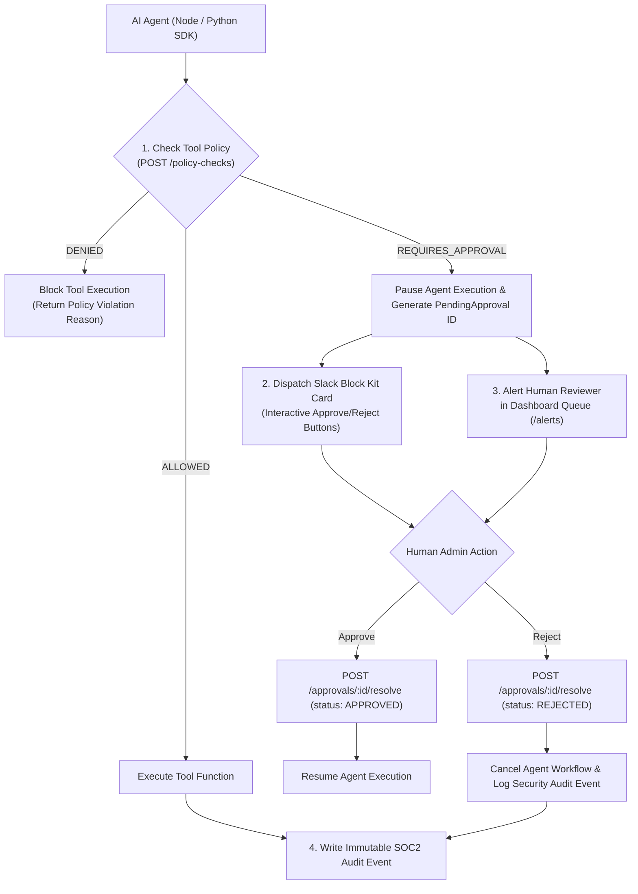

# 🛡️ AI Safety, Tool Interceptors & Human-in-the-Loop (HITL) Governance Guide
## Enterprise Policy Engine, Slack Approval Workflows, PII Redaction & SOC2 Audit Trails

---

## 📋 Executive Summary & Safety Matrix

As autonomous AI agents gain the ability to execute real-world operations (database mutations, financial transfers, email dispatches, infrastructure deployments), enterprise security requires deterministic policy gates and Human-in-the-Loop (HITL) authorization channels.

This guide details the architectural implementation of the **Tool Interceptor Policy Engine**, **Slack Block Kit 1-Click Approvals**, **PII Regex Redactor**, and **SOC2 Audit Trail Exporter**.

| Feature | Protection Layer | Enforcement Level | Response Action | Target SLA |
| :--- | :--- | :--- | :--- | :---: |
| **Tool Policy Interceptor** | Agent Tool Calls | Pre-Execution Gate | `ALLOWED`, `DENIED`, `REQUIRES_APPROVAL` | `<5ms` |
| **HITL Approval Queue** | Sensitive Operations | Human Interceptor | Slack Card / Dashboard Resolution | Real-Time SSE |
| **Slack Block Kit** | Notification Channel | Interactive Button | 1-Click Approve / Reject webhook dispatch | Immediate |
| **PII Redactor** | Span & Trace Streams | Ingestion Filter | Mask emails, cards, keys (`[EMAIL_REDACTED]`) | `<1ms` |
| **TenantGuard** | API Endpoint Access | Middleware Guard | Multi-Tenant Organization Scope Isolation | `<2ms` |
| **SOC2 Audit Logger** | Admin Mutations | Immutable Log | Append-Only CSV Export (`/audit-events/export`) | Instant |

---

## 📐 HITL Safety & Governance Architecture



---

## 🎯 1. Tool Interceptor Policy Engine

### Concept
Before an agent executes any tool payload (e.g., `send_wire_transfer`, `delete_database_table`), the SDK sends a pre-execution check payload to the Control Plane API (`POST /policy-checks`).

### Policy Rule Evaluation
Policies are evaluated based on:
1. **Tool Name**: Exact tool symbol matching.
2. **Environment**: `development`, `staging`, `production`.
3. **Threshold Rules**: Parameter boundary rules (e.g., allow `send_wire_transfer` if `amount <= $1000`, require approval if `amount > $1000`).

### Implementation Example (TypeScript NestJS Policy Guard)
```typescript
@Injectable()
export class GovernancePolicyService {
  async evaluatePolicy(projectId: string, toolName: string, amount?: number): Promise<PolicyOutcome> {
    const policy = await this.prisma.governancePolicy.findFirst({
      where: { projectId, toolName, isActive: true },
    });

    if (!policy) return { status: 'ALLOWED' };

    if (policy.action === 'DENY') {
      return { status: 'DENIED', reason: `Tool ${toolName} is explicitly blocked by policy.` };
    }

    if (policy.action === 'REQUIRE_APPROVAL' || (amount && amount > policy.maxAutoApproveAmount)) {
      return {
        status: 'REQUIRES_APPROVAL',
        reason: `Amount exceeds auto-approval threshold of $${policy.maxAutoApproveAmount}`,
      };
    }

    return { status: 'ALLOWED' };
  }
}
```

---

## 💬 2. Slack Block Kit Interactive Approval Workflow

When a tool call enters `REQUIRES_APPROVAL` state, the platform generates a `PendingApproval` record in PostgreSQL and dispatches an interactive Slack Block Kit Card to configured Slack webhook channels.

### Slack Card JSON Structure
```json
{
  "blocks": [
    {
      "type": "header",
      "text": { "type": "plain_text", "text": "🛡️ HITL Governance Approval Required" }
    },
    {
      "type": "section",
      "fields": [
        { "type": "mrkdwn", "text": "*Agent ID:*\nfinance-agent-v2" },
        { "type": "mrkdwn", "text": "*Tool:*\nsend_wire_transfer" },
        { "type": "mrkdwn", "text": "*Amount:*\n$5,000.00 USD" },
        { "type": "mrkdwn", "text": "*Environment:*\nproduction" }
      ]
    },
    {
      "type": "actions",
      "elements": [
        {
          "type": "button",
          "text": { "type": "plain_text", "text": "✅ Approve Execution" },
          "style": "primary",
          "value": "approve_approval_id_9021"
        },
        {
          "type": "button",
          "text": { "type": "plain_text", "text": "❌ Reject & Block" },
          "style": "danger",
          "value": "reject_approval_id_9021"
        }
      ]
    }
  ]
}
```

---

## 🔒 3. PII Redaction Engine

### Concept
Sensitive financial information, credit card numbers, email addresses, and API authorization keys must never be stored in plain text or leaked into observability trace logs.

### Regex Redaction Pipeline
Before writing spans to PostgreSQL or broadcasting trace updates over SSE, text strings are processed through the PII Regex Redactor.

| Pattern Type | Regex Pattern | Replacement Output |
| :--- | :--- | :--- |
| **Email Address** | `[a-zA-Z0-9._%+-]+@[a-zA-Z0-9.-]+\.[a-zA-Z]{2,}` | `[EMAIL_REDACTED]` |
| **Credit Card** | `\b(?:\d[ -]*?){13,16}\b` | `[CARD_REDACTED]` |
| **Bearer Token / Key** | `(?i)(bearer\|api_key\|secret)[\s=:]+[\w-]{16,}` | `[KEY_REDACTED]` |

---

## 📜 4. Immutable SOC2 Audit Trail & CSV Exporter

Every policy modification, API key creation, user login, and HITL approval resolution produces an immutable audit event record in PostgreSQL.

### Exporting SOC2 Audit Logs via API
```bash
# Export audit logs in CSV format for compliance auditors
curl -X GET "http://localhost:3000/organizations/org_default/audit-events/export?format=csv" \
  -H "Authorization: Bearer $JWT_TOKEN" \
  -o soc2_audit_log.csv
```

---

## 📋 Security Verification Checklist

- [x] All high-risk tools configured with `REQUIRE_APPROVAL` policies.
- [x] Slack webhook URLs verified in project integrations settings.
- [x] PII Regex Redactor active on ingestion pipeline (`POST /ingest`).
- [x] Multi-tenant isolation verified with `TenantGuard` middleware.
- [x] SOC2 Audit Log CSV Exporter tested and validated.
