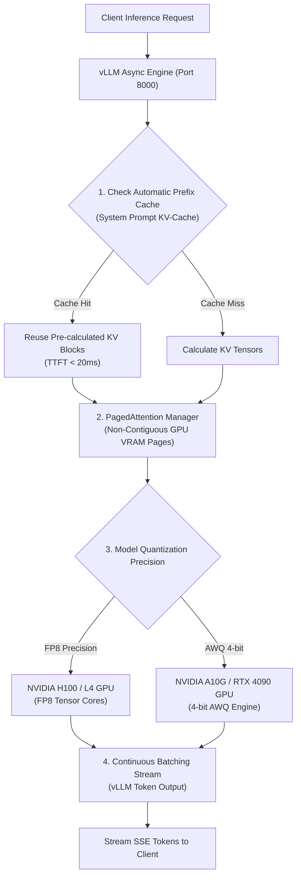

# 🚀 Model Serving, PEFT/LoRA Fine-Tuning & Quantization Guide
## High-Throughput vLLM Serving, PagedAttention, LoRA Fine-Tuning & Quantization Math

---

## 📋 Executive Summary & Serving Matrix

Serving open-weights Large Language Models (LLMs) in enterprise private clouds requires high throughput, optimal VRAM memory budgeting, and cost-efficient quantization techniques.

This guide details the architectural implementation of **vLLM High-Throughput Inference**, **PagedAttention & Prefix Caching**, **PEFT/LoRA Fine-Tuning**, and **AWQ/FP8 Model Quantization**.

| Serving Architecture | Primary Benefit | Throughput Gain | VRAM Memory Reduction | Target Use Case |
| :--- | :--- | :---: | :---: | :--- |
| **PagedAttention (vLLM)** | Virtual Memory KV-Cache | **24x Throughput** | 80% Memory Waste Saved | High-Concurrency API |
| **Automatic Prefix Caching** | Reuses KV-Cache | **10x TTFT Speedup** | Zero duplicate KV math | Static System Prompts |
| **LoRA / QLoRA Adapters** | Small Parameter Adapters | **90% API Cost Cut** | Fine-tune in 4-bit NF4 | Domain-Specific SLMs |
| **AWQ 4-bit Quantization** | Activation-aware Weights | **3x GPU Capacity** | 75% VRAM Reduction | Fit 70B model on 1 GPU |
| **FP8 Precision Serving** | Native H100/L4 Hardware | **2x Speedup** | 50% VRAM Reduction | Production Serving |

---

## 📐 vLLM Serving & Quantization Architecture



---

## 🎯 1. vLLM Engine & PagedAttention Mechanics

Standard PyTorch LLM serving allocates continuous GPU memory for the Key-Value (KV) cache based on `max_sequence_length`. This leads to **60%–80% GPU memory fragmentation and waste**.

### PagedAttention
vLLM solves memory fragmentation by partitioning the KV cache into fixed-size physical memory pages (similar to Virtual Memory paging in OS kernels).
* **Memory Utilization**: Achieves near 100% GPU VRAM utilization.
* **Throughput**: Increases concurrent request handling capacity by up to **24x**.

### Docker Deployment Command (vLLM Serving)
```bash
# Launch vLLM OpenAI-Compatible Server for Llama-3.1-8B-Instruct
docker run --gpus all -p 8000:8000 --ipc=host \
  vllm/vllm-openai:latest \
  --model meta-llama/Meta-Llama-3.1-8B-Instruct \
  --enable-prefix-caching \
  --max-model-len 8192 \
  --gpu-memory-utilization 0.90
```

---

## 🧬 2. Parameter-Efficient Fine-Tuning (PEFT / QLoRA)

Instead of updating all 70 billion parameters during training (which requires massive GPU clusters), **LoRA (Low-Rank Adaptation)** freezes original model weights $W_0$ and injects trainable rank-decomposition matrices $A$ and $B$:

$$W = W_0 + \Delta W = W_0 + B \cdot A$$
*Where $W_0 \in \mathbb{R}^{d \times k}$, $B \in \mathbb{R}^{d \times r}$, $A \in \mathbb{R}^{r \times k}$, and rank $r \ll \min(d, k)$.*

### QLoRA 4-bit Quantization
QLoRA quantizes base model weights $W_0$ to **4-bit NormalFloat (NF4)** precision while keeping rank matrices $A$ and $B$ in 16-bit Float, enabling full fine-tuning of an 8B model on a single 16GB VRAM GPU (e.g. RTX 4080 / T4).

---

## 📊 3. VRAM Memory Calculation Formulas

Before deploying open models to cloud GPUs, calculate required VRAM memory using these standard formulas:

### 1. Model Weights Memory
$$\text{VRAM}_{\text{weights}} = \frac{\text{Params (Billions)} \times \text{Bytes per Parameter}}{1.073}$$
* **FP16 (16-bit)**: 2 Bytes per parameter $\rightarrow$ 8B model = **16 GB VRAM**
* **INT8 (8-bit)**: 1 Byte per parameter $\rightarrow$ 8B model = **8 GB VRAM**
* **INT4 (4-bit)**: 0.5 Bytes per parameter $\rightarrow$ 8B model = **4 GB VRAM**

### 2. KV-Cache Memory Per Request
$$\text{VRAM}_{\text{KV}} = 2 \times \text{Layers} \times \text{Heads} \times \text{HeadDim} \times \text{SeqLen} \times \text{BytesPerElem}$$

---

## 📋 Model Serving Verification Checklist

- [x] vLLM server running with `--enable-prefix-caching`.
- [x] PagedAttention physical page size optimized.
- [x] Model weights quantized to AWQ / FP8 format for target GPU hardware.
- [x] QLoRA adapter training script validated on 4-bit NF4 base model.
- [x] VRAM memory budget and concurrency metrics verified.
