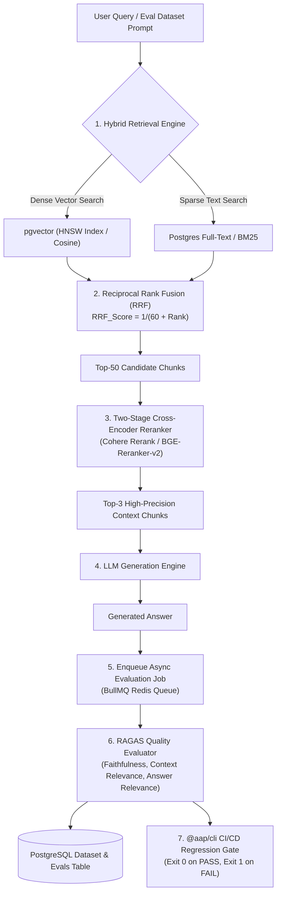

# 🔍 Advanced RAG Pipeline, Hybrid Search & RAGAS Quality Evaluation Guide
## Ingestion, Hybrid Search, Two-Stage Reranking & Quantitative Evaluation Gates

---

## 📋 Executive Summary & Architecture Matrix

Retrieval-Augmented Generation (RAG) platforms require precise document retrieval and continuous quality evaluation to prevent hallucinations and context pollution.

This guide details the end-to-end architecture for **Hybrid Vector + BM25 Search**, **Cross-Encoder Reranking**, **Async Evaluation Workers (BullMQ)**, and the **Ragas Evaluation Triad**.

| Metric | Target SLA / Threshold | Evaluation Formula / Method | Action on Failure |
| :--- | :---: | :--- | :--- |
| **Faithfulness (Groundedness)** | `> 0.85` | Claims in answer supported by context chunks | Fail CI/CD Eval Gate |
| **Context Relevance** | `> 0.80` | Signal-to-noise ratio in retrieved context | Tune Reranker Top-K |
| **Answer Relevance** | `> 0.85` | Answer addresses user query intent | Flag prompt for review |
| **Recall@K (Retrieval)** | `> 0.90` | Ground-truth chunks present in Top-K | Expand hybrid search weights |
| **RERANK Latency** | `< 45ms` | Cohere Rerank / BGE-Reranker-v2 inference | Fallback to BM25 RRF |

---

## 📐 Advanced RAG & Evaluation Pipeline Architecture



---

## 🎯 1. Hybrid Search & Reciprocal Rank Fusion (RRF)

### Concept
Pure vector search (dense embeddings) excels at semantic concepts but fails on exact keyword matching (part numbers, serial numbers, code identifiers). Sparse BM25 search excels at keywords but misses semantic intent. Hybrid Search combines both using **Reciprocal Rank Fusion (RRF)**.

### RRF Formula
$$\text{RRF\_Score}(d) = \sum_{m \in M} \frac{1}{k + r_m(d)}$$
*Where $k = 60$ (smoothing constant), and $r_m(d)$ is the rank of document $d$ in retrieval method $m$.*

### PostgreSQL Hybrid Search SQL Query Example
```sql
WITH vector_search AS (
  SELECT id, content, ROW_NUMBER() OVER (ORDER BY embedding <=> $1) AS rank
  FROM document_chunks
  ORDER BY embedding <=> $1
  LIMIT 50
),
bm25_search AS (
  SELECT id, content, ROW_NUMBER() OVER (ORDER BY ts_rank(to_tsvector('english', content), plainto_tsquery('english', $2)) DESC) AS rank
  FROM document_chunks
  WHERE to_tsvector('english', content) @@ plainto_tsquery('english', $2)
  LIMIT 50
)
SELECT 
  COALESCE(v.id, b.id) AS chunk_id,
  COALESCE(v.content, b.content) AS content,
  (COALESCE(1.0 / (60 + v.rank), 0.0) + COALESCE(1.0 / (60 + b.rank), 0.0)) AS rrf_score
FROM vector_search v
FULL OUTER JOIN bm25_search b ON v.id = b.id
ORDER BY rrf_score DESC
LIMIT 50;
```

---

## ⚡ 2. Two-Stage Cross-Encoder Reranking

### Concept
Vector search returns 50 candidate chunks based on approximate nearest neighbors. Passing 50 chunks to the LLM is expensive and introduces noise. The **Cross-Encoder Reranker** processes pairs of `(Query, Document)` together, outputting a true relevance score from `0.0` to `1.0`.

### Reranking Workflow
```text
50 Candidate Chunks  ──> [ BGE-Reranker-v2 / Cohere Rerank ] ──> Top 3 Chunks (Passed to Prompt)
```

---

## 📊 3. RAGAS Evaluation Triad Metrics

The BullMQ Async Worker Processor computes the three core RAG evaluation metrics:

### 1. Faithfulness (Groundedness)
Measures whether claims in the generated response can be directly inferred from the retrieved context chunks.
$$\text{Faithfulness} = \frac{|\text{Supported Claims}|}{|\text{Total Claims Output}|}$$

### 2. Context Relevance
Measures what fraction of the retrieved context chunks are directly relevant to the user query.
$$\text{Context Relevance} = \frac{|\text{Relevant Sentences in Context}|}{|\text{Total Sentences in Context}|}$$

### 3. Answer Relevance
Measures whether the generated answer directly addresses the prompt question without outputting off-topic information.

---

## 🤖 4. CI/CD Prompt Regression CLI Gate (`@aap/cli`)

Integrate automated RAG quality gates into GitHub Actions pipelines to block bad prompt or retrieval deployments:

```bash
# Execute evaluation check against baseline dataset
aap eval \
  --api-key=$AAP_API_KEY \
  --project-id=$PROJECT_ID \
  --dataset-id=$DATASET_ID \
  --min-faithfulness=0.85 \
  --min-relevance=0.80

# Result:
# ✅ PASS: Faithfulness = 0.91 (Threshold >= 0.85)
# ✅ PASS: Context Relevance = 0.84 (Threshold >= 0.80)
# Exit Code: 0
```

---

## 📋 RAG Quality Verification Checklist

- [x] `pgvector` HNSW indexes enabled on embedding columns.
- [x] PostgreSQL Full-Text Search / BM25 configured with English stemming.
- [x] Reciprocal Rank Fusion (RRF) smoothing constant set to $k=60$.
- [x] Two-Stage Cross-Encoder Reranker active (filtering Top-50 candidate chunks to Top-3).
- [x] BullMQ Worker dataset evaluation processor active for async eval jobs.
- [x] GitHub Actions `@aap/cli` evaluation gate integrated into CI/CD pipelines.
