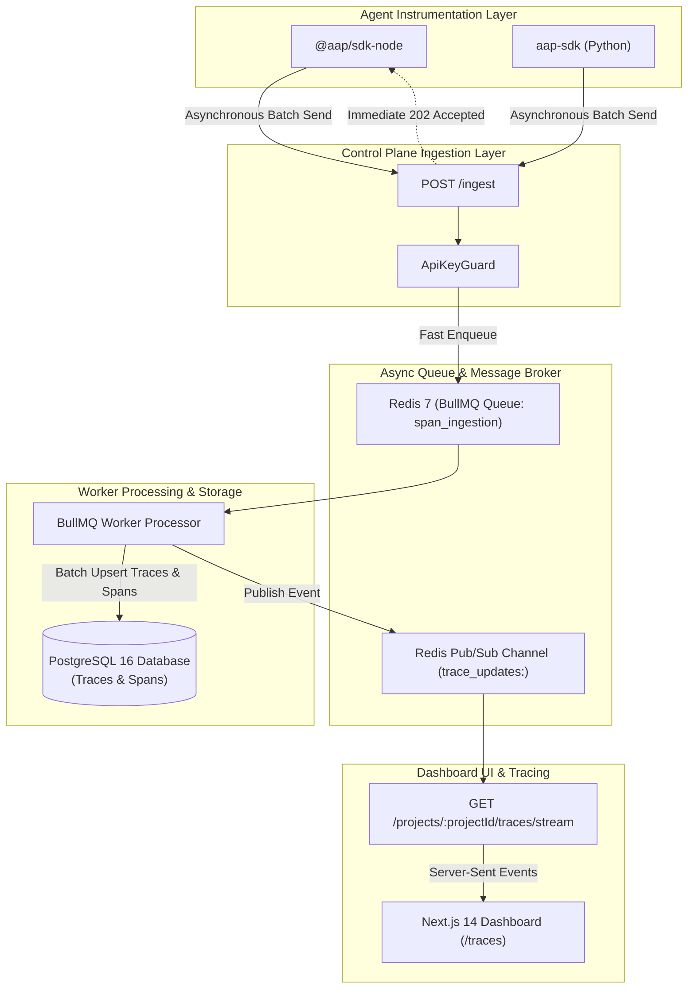

# ⚡ Real-Time Telemetry Streaming, OpenTelemetry & Trace Search Guide
## High-Throughput Span Ingestion, Redis SSE Streaming & Natural Language Trace Search

---

## 📋 Executive Summary & Telemetry Matrix

Observability for enterprise AI agent systems requires non-blocking span collection, real-time live streaming to governance dashboards, and natural language search over millions of execution traces.

This guide details the architectural implementation of **Non-Blocking Span Ingestion (`POST /ingest`)**, **Redis Pub/Sub SSE Live Streaming**, **SDK Asynchronous Batching**, and **Natural Language Trace Search**.

| Feature | Subsystem Layer | Mechanism / Technology | Performance Benchmark |
| :--- | :--- | :--- | :---: |
| **Ingestion Endpoint** | NestJS API | Async `202 Accepted` + BullMQ Queue Push | `< 5ms` Response Time |
| **SDK Event Buffering** | Node.js / Python SDKs | Memory Queue + Exponential Backoff | Non-blocking to agent |
| **Real-Time Streaming** | Dashboard SSE | Redis Pub/Sub (`trace_updates:<projectId>`) | Real-time (`< 15ms`) |
| **Trace Storage** | PostgreSQL 16 | Relational Traces & Spans tables | Idempotent UUID upsert |
| **Semantic Trace Search** | Control Plane API | Keyword + Metadata Filtering Query Engine | `< 50ms` Search Latency |

---

## 📐 Real-Time Telemetry & Tracing Pipeline Architecture



---

## 🎯 1. Non-Blocking Span Ingestion (`POST /ingest`)

To prevent observability overhead from slowing down agent responses, the ingestion endpoint accepts telemetry batches asynchronously:

1. **ApiKey Validation**: Verifies the API Key hash via `ApiKeyGuard` (`< 2ms`).
2. **Fast Enqueue**: Pushes span payload directly to the Redis BullMQ queue (`span_ingestion`).
3. **Immediate `202 Accepted`**: Returns HTTP `202 Accepted` to the SDK in **< 5ms**.

```typescript
// Controller Endpoint Implementation
@Post('/ingest')
@UseGuards(ApiKeyGuard)
@HttpCode(HttpStatus.ACCEPTED)
async ingestSpans(@Body() body: IngestSpansDto, @Req() req: Request) {
  const projectId = req['project'].id;
  await this.telemetryQueue.add('process_spans', {
    projectId,
    spans: body.events,
    receivedAt: new Date().toISOString(),
  });
  return { status: 'accepted', queuedEvents: body.events.length };
}
```

---

## ⚡ 2. Node.js & Python SDK Batching Architecture

Both SDKs buffer span telemetry events locally in memory and flush batches in background threads without blocking agent execution.

### SDK Features
* **Batch Flush Trigger**: Flushes whenever memory queue hits `20 events` or timer reaches `5 seconds`.
* **Exponential Backoff**: Retries failed Network sends up to 3 times (`1s`, `2s`, `4s`).
* **Idempotent Operations**: Uses client-generated `eventId` UUIDs to ensure no duplicate spans are created if network retries occur.

```python
# Python SDK Instrumentation Usage
from aap_sdk import AapClient, trace_span

aap = AapClient(api_key="aap_live_...", base_url="http://localhost:3000")

@trace_span(client=aap, agent_id="support-agent", provider="openai", model="gpt-4o")
def handle_support_query(user_query: str):
    # Agent logic executed here
    return "Issue resolved"
```

---

## 📡 3. Redis Pub/Sub to Server-Sent Events (SSE) Live Streaming

The Next.js Control Plane Dashboard subscribes to live trace updates over an SSE endpoint:

```
GET /projects/:projectId/traces/stream
```

### Event Stream Payload Format
```text
event: trace_update
data: {"traceId":"tr_80192","agentId":"finance-agent","status":"ok","totalTokens":245,"costUSD":0.0042,"durationMs":320}

event: span_added
data: {"spanId":"sp_102","traceId":"tr_80192","name":"call_llm","eventType":"llm","model":"gpt-4o"}
```

---

## 🔍 4. Natural Language Trace Search Engine

Engineers can search across historical agent execution traces using natural language keywords, model names, user IDs, or error codes:

```bash
# Query traces by natural language keyword or model
curl -X GET "http://localhost:3000/projects/proj_default/traces/search/query?q=database_timeout" \
  -H "Authorization: Bearer $JWT_TOKEN"
```

---

## 📋 Telemetry & Observability Verification Checklist

- [x] `POST /ingest` responds with `202 Accepted` in `< 5ms`.
- [x] Node.js & Python SDK background batching active.
- [x] Redis Pub/Sub SSE streaming connected to Next.js Dashboard (`/traces`).
- [x] Idempotent span upserts active using client UUIDs.
- [x] Natural Language Trace Search engine tested and validated.
