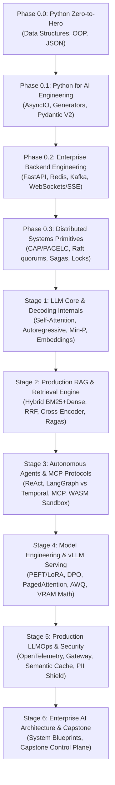
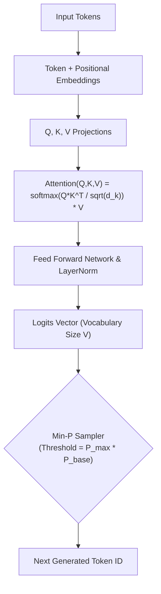
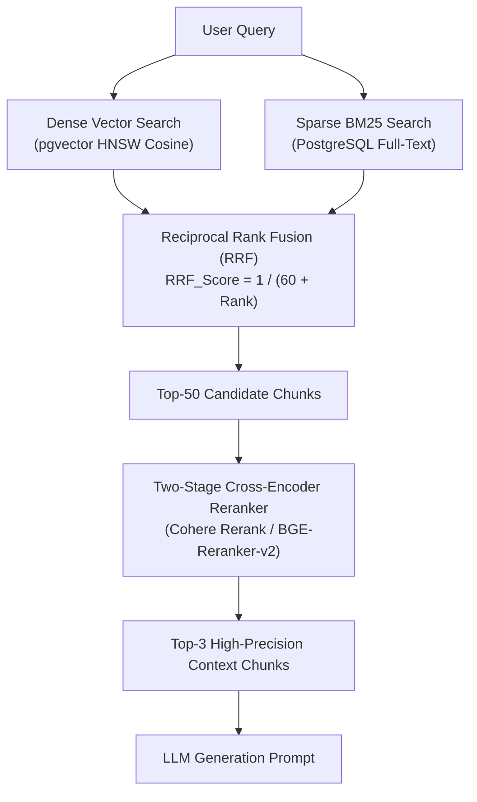
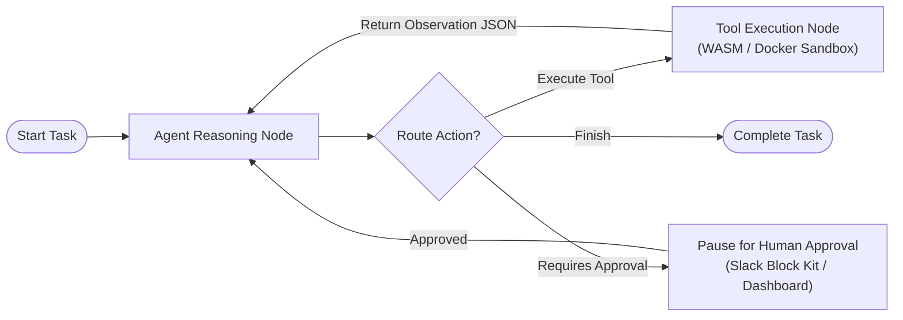
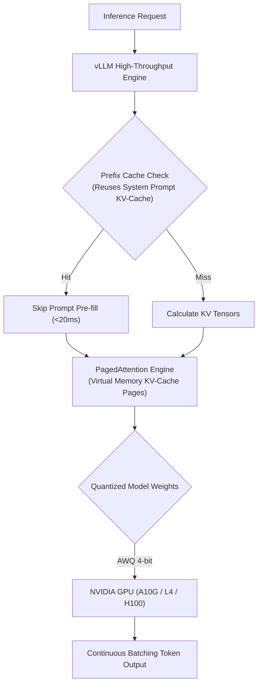
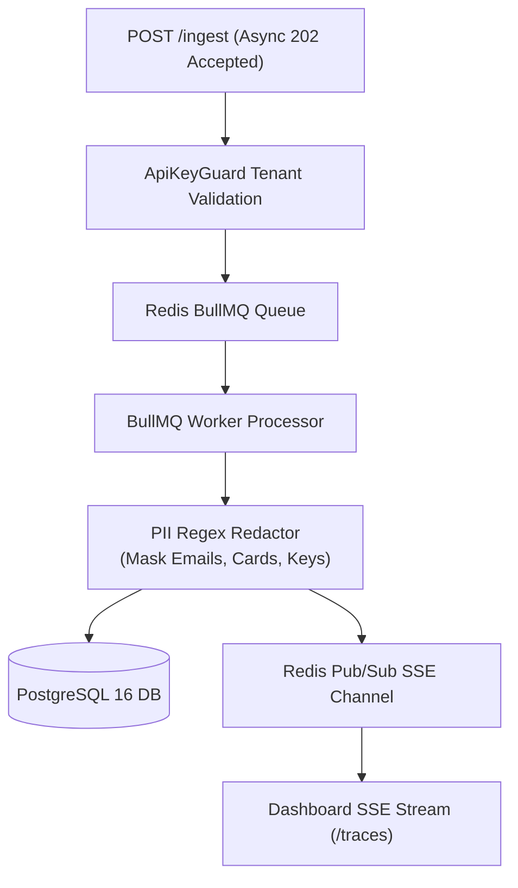
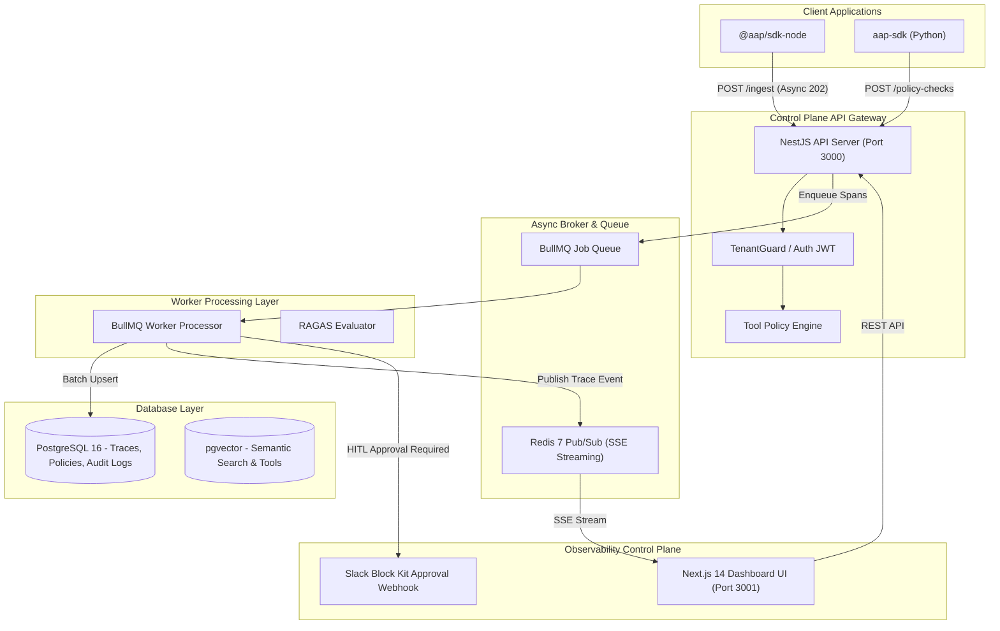

# 🚀 Zero-to-Hero AI & LLM Systems Architect Interview Roadmap
## From Python Foundations & Distributed Backend Systems to Frontier LLM Internals, RAG, Autonomous Agents & Enterprise AI System Design

---

## 🗺️ Complete Learning & Interview Progression Path



---

## 🟢 Phase 0: Engineering & Distributed Systems Foundations

```mermaid
flowchart LR
    Client["Client / User Agent"] --> API["FastAPI / NestJS Gateway"]
    API --> AsyncLoop["AsyncIO Event Loop"]
    AsyncLoop --> Cache{"Redis Distributed Cache<br/>(SHA-256 Hash Match)"}
    
    Cache -->|Cache Hit (<5ms)| FastReturn["Return Response ($0)"]
    Cache -->|Cache Miss| Kafka["Kafka Topic Ingestion Queue"]
    Kafka --> Worker["Distributed Worker Thread Pool"]
```

### 1. Python AsyncIO Internals & Event Loop
* **Concept**: Python's `asyncio` is single-threaded and relies on a cooperative event loop. `await` yields execution control back to the loop while I/O operations (network, DB queries, LLM API calls) run in the background.
* **Why it matters for AI**: LLM inference calls spend 95% of their time waiting on HTTP network I/O. Using `async` allows a single API worker to handle thousands of concurrent streaming connections.

```python
import asyncio
import httpx

# Concurrent LLM Streaming Requests
async def fetch_llm_stream(prompt: str):
    async with httpx.AsyncClient() as client:
        response = await client.post(
            "http://localhost:3000/ingest",
            json={"prompt": prompt},
            timeout=30.0
        )
        return response.json()

async def main():
    prompts = ["Explain RAG", "Explain vLLM", "Explain LangGraph"]
    results = await asyncio.gather(*(fetch_llm_stream(p) for p in prompts))
    print(results)

asyncio.run(main())
```

---

## ⚡ Stage 1: LLM Core Internals, Decoding & Vector Geometry



### 1. Self-Attention Math
$$\text{Attention}(Q, K, V) = \text{softmax}\left(\frac{QK^T}{\sqrt{d_k}}\right)V$$
* **Key Concept**: $QK^T$ measures pairwise similarity between tokens. Scaling by $\sqrt{d_k}$ prevents gradients from vanishing in high-dimensional vector spaces.

### 2. Min-P Sampling Formula
$$\text{Threshold} = p_{\text{max}} \times p_{\text{base}}$$
* If the highest token probability $p_{\text{max}} = 0.80$ and $p_{\text{base}} = 0.05$, only tokens with $p \ge 0.04$ are sampled. This eliminates random low-probability tail tokens.

---

## 🔍 Stage 2: Production RAG & Retrieval Engine



### 1. Reciprocal Rank Fusion (RRF) Formula
$$\text{RRF\_Score}(d) = \sum_{m \in M} \frac{1}{k + r_m(d)}$$
* Merges dense vector search ranks with sparse keyword BM25 search ranks without requiring score normalization.

---

## 🤖 Stage 3: Autonomous Agents, LangGraph & MCP Protocols



### 1. Model Context Protocol (MCP) Client-Server Standard
MCP standardizes how agents discover and execute tools using JSON-RPC 2.0 over `stdio` or `SSE`:
* `tools/list`: Client discovers available tool schemas.
* `tools/call`: Client invokes tool with validated JSON parameters.

---

## 🚀 Stage 4: Model Engineering, Serving & GPU VRAM Math



### 1. GPU VRAM Memory Budget Formula
$$\text{VRAM}_{\text{weights}} = \frac{\text{Params (Billions)} \times \text{Bytes per Parameter}}{1.073}$$
* **70B Model in FP16 (2 Bytes/param)** = **130.4 GB VRAM** (Requires 2x 80GB A100 GPUs).
* **70B Model in AWQ 4-bit (0.5 Bytes/param)** = **32.6 GB VRAM** (Fits on single 48GB GPU).

---

## 🛡️ Stage 5: Production LLMOps, Security & Guardrails



---

## 🏗️ Stage 6: Enterprise AI Architecture & Capstone Platform



---

## 📋 Zero-to-Hero Architect Readiness Checklist
- [x] **Phase 0**: Python AsyncIO, Pydantic V2, FastAPI, Redis, Kafka, Sagas, Distributed Locks.
- [x] **Stage 1**: Transformer Self-Attention Math, Autoregressive Decoding, Min-P, Cosine Vector Geometry.
- [x] **Stage 2**: Hybrid Search (BM25 + Dense), RRF Formula, Two-Stage Cross-Encoder Reranking, RAGAS Evals.
- [x] **Stage 3**: ReAct Loop, LangGraph Cyclic Graphs, MCP Protocol, Sandbox Isolation, Multi-Agent Swarms.
- [x] **Stage 4**: PEFT/LoRA Fine-Tuning, vLLM PagedAttention, AWQ Quantization, VRAM Memory Calculations.
- [x] **Stage 5**: OpenTelemetry Tracing, Semantic Caching, PII Redaction, Multi-Tenancy.
- [x] **Stage 6**: Capstone System Architecture Blueprint & 60+ Architect Defenses.
