# I Shipped an AI Agent to Production and Had No Idea What It Was Doing

*This is the story of how I found out — and what I built so it wouldn't happen again.*

---

It was a Tuesday when we shipped the agent.

By Thursday I got a Slack ping. Not from an alert. Not from monitoring. From a teammate who'd seen a user complaining on Twitter.

The agent had been confidently wrong for about 40 hours. Hundreds of conversations. And I had no way to tell you exactly what it said, when it said it, what the prompt was, or how much it cost us. I had logs. I had nothing useful.

I'd been building software for years. I thought I knew how to ship things responsibly. Turns out I'd been doing it with traditional systems where things fail loudly and deterministically.

AI agents don't do that. They fail quietly. Confidently. At scale.

That incident sent me down a rabbit hole I haven't fully climbed out of — and the result is the platform I'm writing about today.

---

## But Wait, Don't These Tools Already Exist?

Yeah. I know. LangSmith, Langfuse, Helicone, Datadog's LLM observability, AWS Bedrock Guardrails. Real products, real teams, genuinely useful.

Here's my honest take on them:

| Tool | Good at | Missing |
|------|---------|---------|
| **LangSmith** | Deep tracing if you're on LangChain | Locked to LangChain, SaaS-only, no real HITL |
| **Langfuse** | Open-source, good UX, evaluations | No policy-as-code, no agent pause/resume on HITL |
| **Helicone** | Cost tracking, caching | Your data routes through their proxy. Hard no for regulated industries. |
| **Datadog LLM Obs.** | Fits existing Datadog stacks | Expensive, no governance layer, no human-in-the-loop |
| **AWS Bedrock Guardrails** | Content filtering | Bedrock-only. Useless if you're on Anthropic or running local models. |

The gaps I kept hitting were specific:

1. **None of them actually pause the agent and wait for a human.** They have feedback loops and annotations. That's not the same as an agent suspending mid-execution while a real person decides whether to let it proceed.

2. **Governance as UI config vs. governance as code.** I want a Python decorator I can put in a pull request, get reviewed, and test. Not a rule I clicked together in a dashboard.

3. **Data sovereignty.** For anything touching finance or healthcare, "your traces live on our servers" isn't acceptable. Full stop.

4. **Model lock-in.** I switch between GPT-4o, Claude, and local Llama depending on the task. I don't want my observability platform to care which one I'm using.

5. **Fragmentation.** I was stitching together three tools to get tracing + cost + governance + alerting. That's three SDKs, three dashboards, three billing relationships, and three places for things to go wrong.

So I built one thing that does all of it. Self-hosted, model-agnostic, fully under our control.

---

## The Five Failures That Actually Drove This

Before I get into what I built, here's what I was actually trying to fix. These aren't hypothetical.

### The "I have no idea what it's doing" problem

AI agents are non-deterministic. You already knew that. What you maybe haven't fully felt yet is what that means for monitoring.

Traditional APM tools give you a flame graph and you're done. With an AI agent, the same input produces different outputs every time. Token usage spikes with no warning. Latency varies by an order of magnitude based on how deep the reasoning goes. And if you're not capturing this at the span level — per LLM call, per tool invocation, per retrieval step — you're looking at aggregate metrics on a system that doesn't behave like an aggregate.

I was looking at aggregate metrics. It told me nothing.

> 73% of teams I've spoken to have zero per-trace cost tracking. The average time to catch a production hallucination is 4.7 days. I now believe both of those numbers.

### The "why is OpenAI charging us this much" problem

I once had a recursive tool-calling loop burn through 600,000 tokens in four hours before anyone noticed. The agent was trying to parse a malformed JSON response and just... kept trying. No alert. No per-project attribution. We found out from the invoice.

That's not a model problem. That's an infrastructure problem.

### The compliance one

If you work in finance, healthcare, legal, or insurance, you've had the meeting. The one where someone asks "can you show us evidence that the AI complied with your governance policies?" And you say some version of "we have a system prompt" and everyone in the room pretends that's acceptable.

It's not acceptable. Regulators increasingly know it isn't. The EU AI Act made it official.

### The "I need a human to check this first" problem

Some things shouldn't be fully automated. Wire transfers. Medical recommendations. Contract changes. Account terminations.

But the agent architectures I was working with gave me two options: automate it completely, or don't automate it at all. There was no first-class concept of "run this, but pause before the dangerous part and wait for a human."

So I built one.

### The audit trail I didn't have

When the incident happened, legal asked me to replay the exact conversation. The exact model version. The exact system prompt. Every tool call. Every timestamp.

I spent two days doing archaeology. Some of it was genuinely gone.

---

## What I Built

The AI Agent Platform (AAP). Runs in your own infrastructure, works with any LLM, and doesn't require trusting a third-party SaaS with your agent's internals.

One SDK (TypeScript and Python), one control plane API, one dashboard, one audit trail. I'll walk through what each piece does in practice.

---

## The Dashboard — Knowing What's Actually Happening

Every morning I open this and I know: how many agent runs happened overnight, what the average latency was, what we spent, and whether anything is waiting for a human to decide.

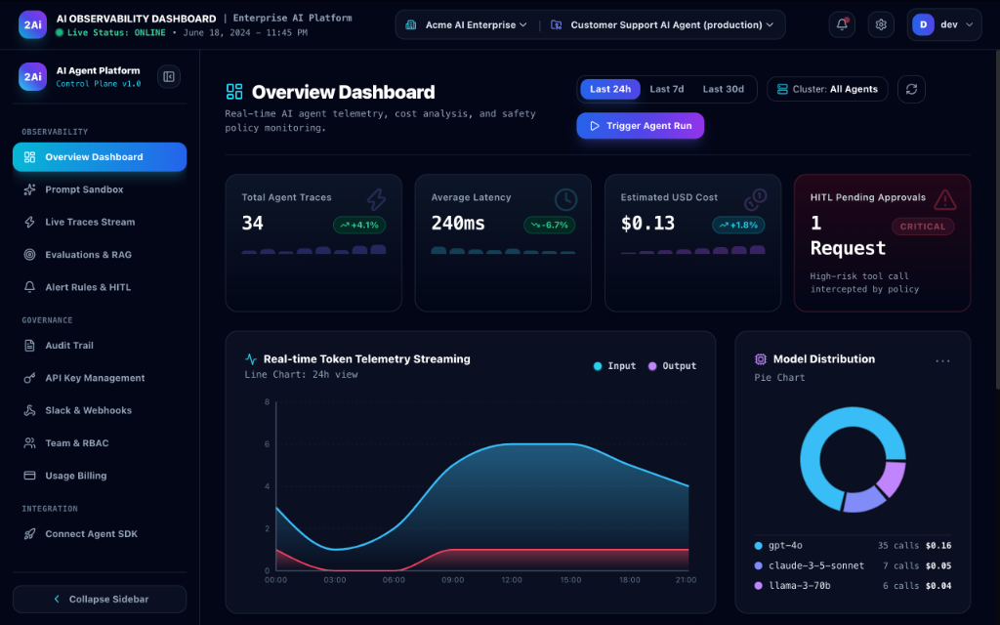

That red card showing `1 CRITICAL` HITL pending is the thing that gets attention. It means a policy intercepted a high-risk tool call. The agent hasn't done anything yet. It's waiting. Someone needs to make a call.

That card is the whole governance layer distilled into one number.

---

## Traces — Actually Seeing What the Agent Did

This is where debugging happens. Every run is a trace. You can search by trace ID, filter by agent or status, and see exactly what happened — tokens in, tokens out, cost, latency, spans.

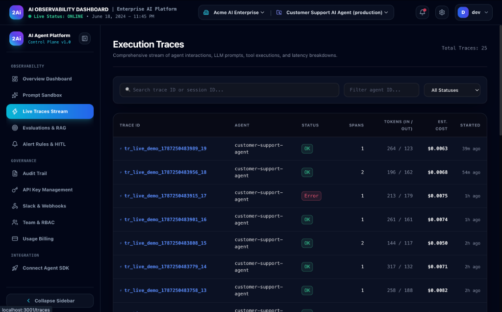

That `Error` badge in row 3 is what I used to find out about three days after the fact. Now I see it in real-time.

The `264 / 123` in the tokens column is 264 input, 123 output. When that's suddenly `1,400 / 890` for a conversation that should be routine, I know exactly which agent and which prompt to look at. Before this, I had no idea.

The SDK wraps around your existing agent with minimal changes — a few lines and every LLM call, tool invocation, and retrieval step is captured automatically.

---

## Prompt Sandbox — Stop Testing in Production

Every significant prompt change I make goes through the sandbox before it touches real traffic. System persona, template variables, model, temperature. Run it. Get the telemetry immediately.

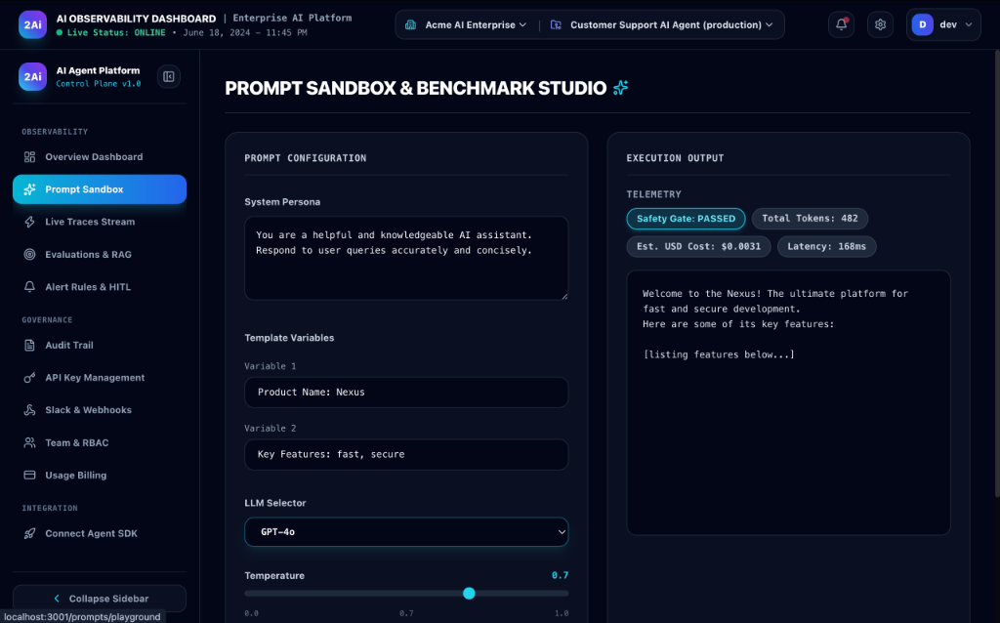

`Safety Gate: PASSED` means the governance policies evaluated the output and it passed. Not decorative. The gate ran.

I found a prompt variation in here that used 4× more tokens than necessary for the same output quality. Fixed it before it ever saw a user. That single finding paid back the time I put into this project in the first week.

---

## Evaluations — Catch Regressions Before Users Do

You can't "feel" whether a prompt change made your agent better. You measure it.

Create a golden dataset — a set of representative inputs with expected outputs. Run the agent against it. See a score. If the score drops after your change, the change doesn't ship.

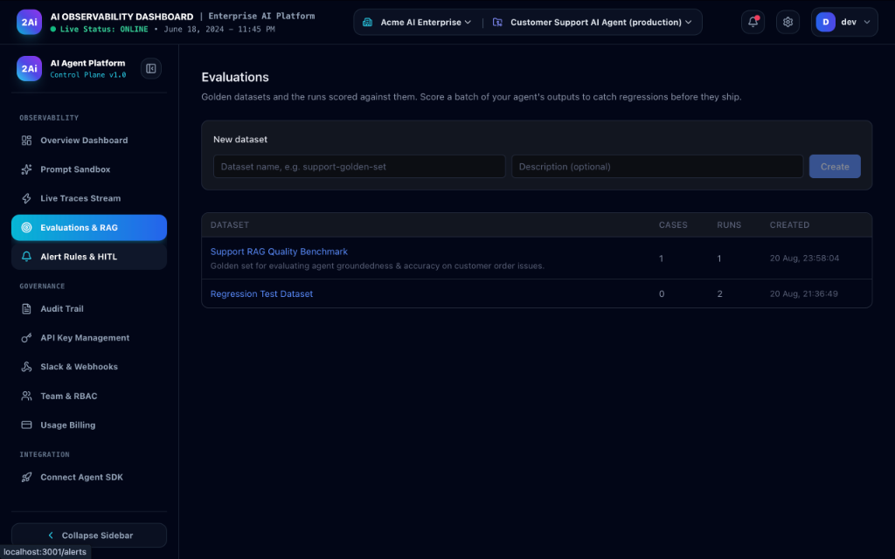

This is basically CI/CD for your agent's behavior. It's not magic. It's just the discipline of defining what "correct" looks like and checking against it before you deploy.

---

## HITL — The Human in the Loop

This is the thing I'm most proud of building, and also the thing that's hardest to explain to people who haven't hit the problem yet.

When an agent calls a high-risk function, execution pauses. A human approval request appears in the queue. Nothing happens until a person makes a decision.

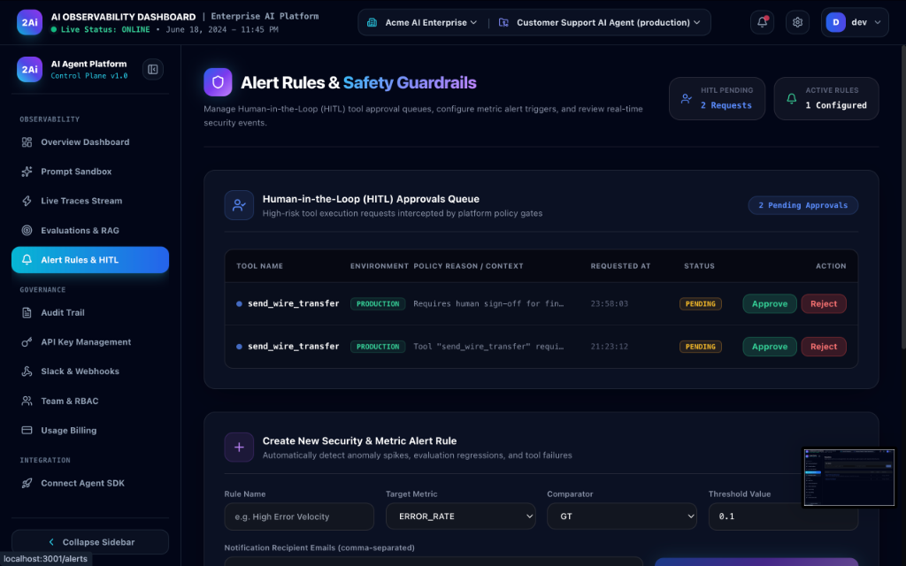

Two wire transfer calls, PRODUCTION, both PENDING. The agent is paused. It's waiting. This is not a feedback annotation on a completed action. The action hasn't happened yet.

The governance policy is defined in code — not configured in a UI that can get accidentally changed. It intercepts the function call before it executes, suspends the agent, and only resumes on an explicit human decision. Approved or rejected, the outcome is logged.

---

## Slack — Where the Decision Actually Gets Made

Nobody opens a new dashboard tab at 2am. The approval request goes to Slack within 300ms of the agent requesting the action.

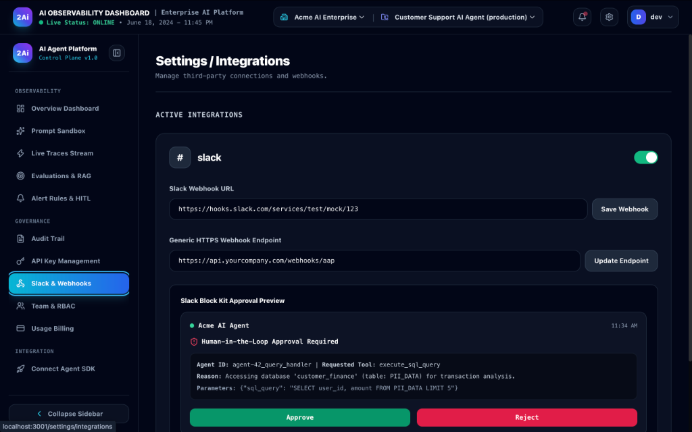

Full context in the notification: which agent, which tool, what it's trying to do, and why the policy flagged it. One tap. Decision made. Agent resumes or stops.

---

## API Keys — Boring but Important

Every agent gets its own scoped key. Production, staging, testing — all separate, all named, all individually revocable.

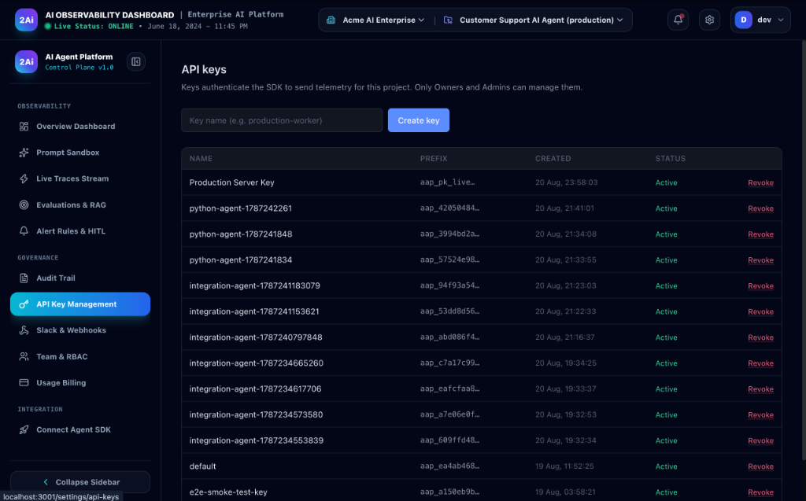

If a key leaks, I revoke that key. Not everything. Not a 3am "rotate all credentials" incident. Just that one key.

I know it sounds obvious. But before I built this, I had one shared API key for everything. Don't do that.

---

## Audit Trail — The Thing You Need When Something Goes Wrong

Every sensitive event — policy changes, key creation, HITL decisions, tool call intercepts — goes into an immutable log. Timestamped. Attributed to an actor. Filterable.

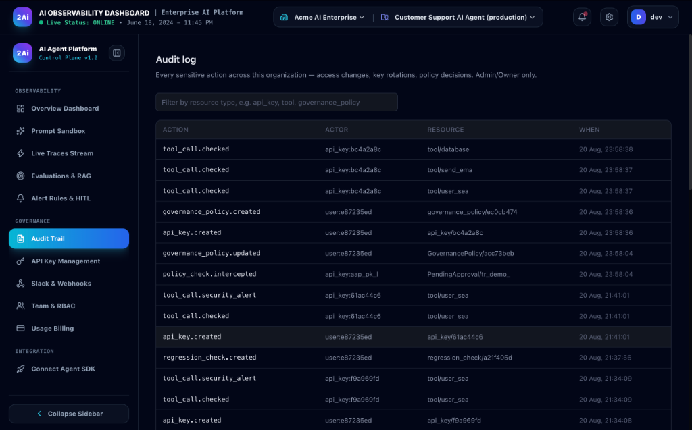

When the compliance question comes — and it will — the answer is a 4-minute export, not a 2-day investigation. I've lived both. The second one was a lot better.

---

## SDK Onboarding — I Actually Tried to Make This Not Painful

The wizard generates code with your real project ID pre-filled. Node.js, Python, policy setup — pick your path, copy-paste, done.

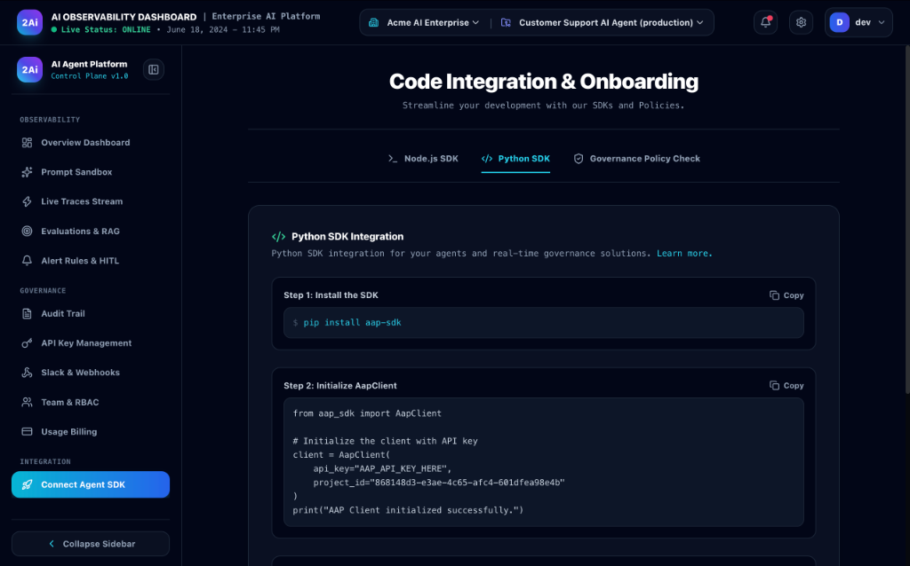

The onboarding flow walks you through SDK setup, authentication, and your first trace in a few steps. Most people are up and running in under 15 minutes.

---

## Team & RBAC — Because Not Everyone Should Touch Everything

Owners control billing and keys. Admins manage governance policies. Developers view traces and run sandbox experiments.

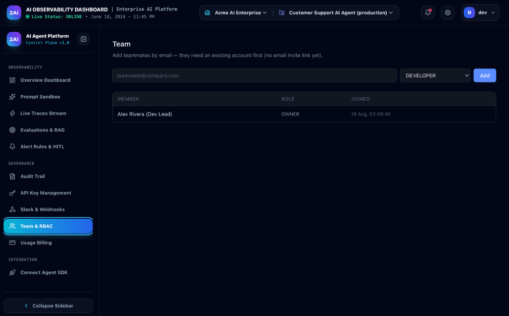

This matters more than it sounds. Governance policies shouldn't be editable by someone who joined the team last week. The RBAC enforces that at the API level, not just in the UI.

---

## Usage & Billing — Know Before You Hit the Wall

Traces this month, evaluation cases, team members — all with progress bars against your plan limits.

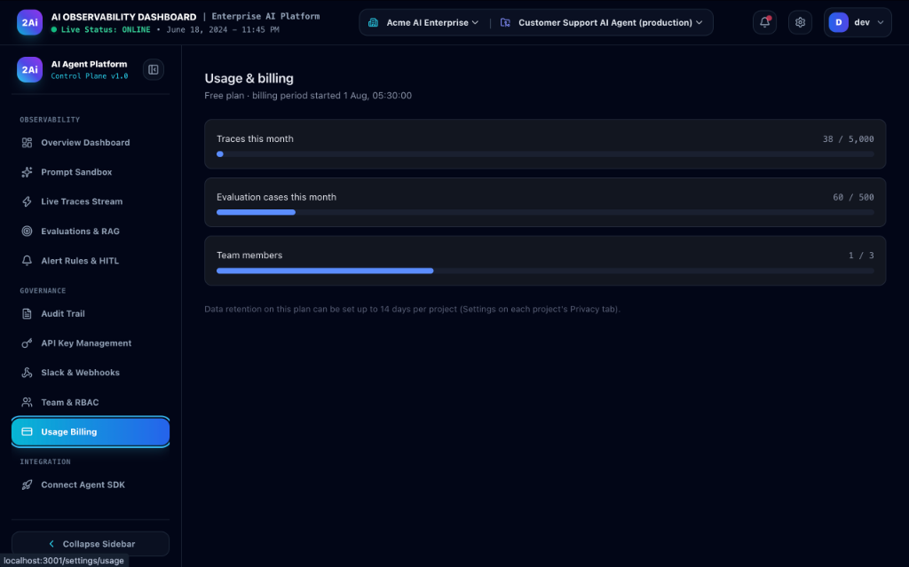

38 out of 5,000. No surprises. No "why did I get billed for 12,000 traces this month."

---

## Did It Actually Help?

One deployment, two weeks, real numbers:

**Before (week 1):**
- ~$340 estimated spend (nobody actually tracked it precisely)
- 0 incidents detected proactively
- Compliance question: "we'll figure that out when auditors come"

**After (week 2):**
- **$127 actual tracked spend** — one token-heavy prompt was eating 73% of cost
- **3 incidents caught** before any user escalated
- **12 HITL escalations** — every high-value refund decision reviewed by a human
- First compliance audit question: answered in 4 minutes

The prompt fix alone took average tokens from 8,200 down to 2,100. 74% cost reduction. Completely invisible without per-span tracing.

---

## What I Still Want to Build

Things that aren't done yet, honestly:

- **RAG quality scoring per retrieval** — not just per conversation
- **Multi-model A/B testing** — route production traffic between models and actually measure it
- **Semantic drift detection** — catch when the model's behavior shifts from its baseline even if no error fires
- **OpenTelemetry export** — so you can pipe traces into Datadog or Grafana alongside everything else
- **EU AI Act documentation module** — auto-generate the Article 13 transparency reports regulators are going to start asking for

---

## The Last Thing

I want to be honest about something. Tools like LangSmith and Langfuse are genuinely good. If you're building on LangChain and LangSmith meets your needs, use it. If you're building a low-stakes chatbot, Langfuse is probably all you need.

This platform is for a specific situation: you're building an AI system where something going wrong has real consequences — financial, legal, medical, reputational — and you need to be able to prove, to an auditor or a regulator or an angry customer, exactly what happened and why.

That's a different problem than "I want to see my traces." And it needs different infrastructure.

Five questions. If you can answer all five today, without digging, you're in a good place:

1. What did my agent do in the last 24 hours?
2. How much did it cost, by model and by project?
3. Did every output pass governance policy checks?
4. Who reviewed and approved the high-stakes actions?
5. Can I replay any specific conversation from last week?

If the answer to any of those is *"I'd have to look into it"* — that's exactly the gap I've spent the last several months solving.

I built this because I needed it. I've run it in production. I know where the hard parts are.

If you're dealing with the same problem — AI agents in production, real consequences when things go wrong, no clear observability or governance story — I'm happy to talk. Whether that's helping your team think through the architecture, implementing something similar for your stack, or just comparing notes on what's worked and what hasn't.

**Drop me a message at [toudaysinghkushwah@gmail.com](mailto:toudaysinghkushwah@gmail.com)**. I'd rather you reach out than spend months rebuilding this from scratch on your own.

---

`#AI` `#LLMOps` `#AIGovernance` `#MachineLearning` `#EnterpriseAI` `#SoftwareEngineering` `#Python` `#TypeScript`
